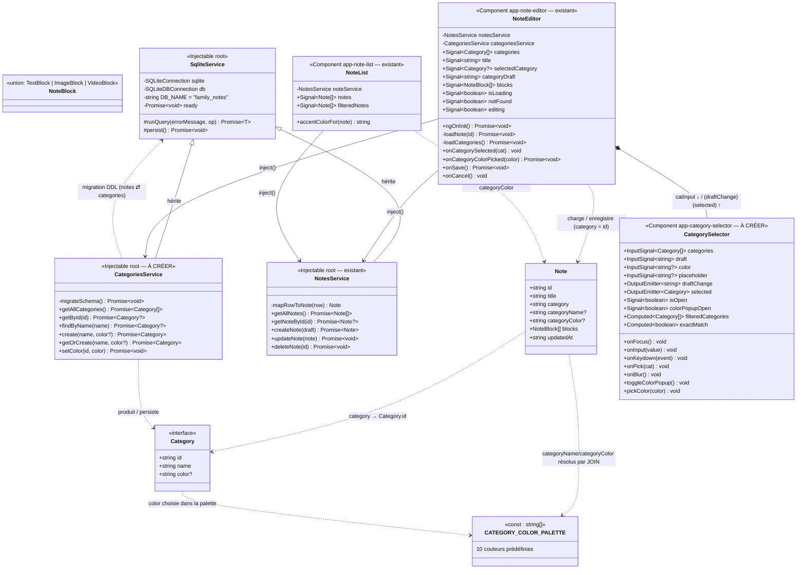

# Approche de développement — Sélecteur de catégories intuitif

> **Date :** 2026-09-26 · **Statut :** brouillon — à valider
> **SPEC :** `.agent/CATEGORIES/FEATURE_CATEGORIES_SELECTEUR.md`
> **Docs de référence :** `.agent/DIAGRAMME_CLASSES_NOTES.md`, `.agent/MODELE_DONNEES_NOTES.md`,
> `.agent/PLAN_NOTES.md`, mémoire projet (écarts NotesService, valider-mermaid)
> **Code de référence :** `note-editor/`, `note-list/`, `core/services/{notes-service,sqlite-service}.ts`,
> `core/models/{note,category}.model.ts`, seed `frontend/public/assets/databases/family_notesSQLite.db`

---

## 0. Décisions de cadrage (tranchées le 2026-09-26)

| # | Décision | Choix |
|---|----------|-------|
| D-C1 | Stockage | **Table `categories` clé par `id`** (`id` PK, `name` UNIQUE, `color`). `Note.category` **migrera vers `Category.id`** — migration des notes existantes requise. |
| D-C2 | Logique | **`CategoriesService` dédié**, héritant de `SqliteService` (même pattern que `NotesService`). |
| D-C3 | Migration | **Peuplement auto** : au premier lancement, les valeurs distinctes de `notes.category` (aujourd'hui des noms) deviennent des catégories, puis `notes.category` est réécrit avec les `id`. |
| D-C4 | Création fluide | La **résolution nom → catégorie** (et création si nouvelle) se fait **à l'enregistrement** de la note (`NoteEditor.onSave`), conformément à la SPEC US3. |
| D-C5 | Anti-doublons | Normalisation **trim + casse** (`"Travail"` ≡ `"travail"` ≡ `" travail "`) : unicité garantie par un index `UNIQUE` sur `name` + comparaison en `COLLATE NOCASE` côté SQL. |

---

## 1. Diagramme de classes

> **Légende :** classes marquées `%% À CRÉER` = nouveau code ; les autres existent déjà
> (cf. `DIAGRAMME_CLASSES_NOTES.md` §1 et §5). Les attributs `?` sont optionnels.

> **Existant vs à créer :**
> - **Existant** (inchangé ou extension légère) : `Note`, `NoteBlock`, `SqliteService`, `NotesService`,
>   `NoteEditor`, `NoteList`.
> - **À créer** : table SQL `categories` + migration (dans `CategoriesService`),
>   `CategoriesService`, `CategorySelector`, `CATEGORY_COLOR_PALETTE`.
> - **Extensions** : `Note` gagne `categoryName?` / `categoryColor?` (résolus par JOIN, non
>   persistés) ; `NotesService` passe à un `LEFT JOIN categories` ; `NoteList` utilise la
>   couleur de catégorie en priorité ; `NoteEditor` remplace l'input texte brut par
>   `CategorySelector`.

## 2. Lecture des relations

| Relation | Signification |
|---|---|
| `Note ..> Category` | `Note.category` stocke désormais **`Category.id`** (D-C1) ; le nom et la couleur affichables sont résolus à la lecture. |
| `SqliteService <|-- Notes/CategoriesService` | Les deux services partagent la connexion, le garde `ready`, le wrapper `runQuery` et le flush `persist` (pattern existant). |
| `CategoriesService ..> SqliteService` | Le service porte aussi la **migration DDL** : création de `categories` + réécriture de `notes.category` (nom → id). |
| `NoteEditor *-- CategorySelector` | L'écran imbrique le sélecteur : `[categories] [draft] [color]` en entrée, `(draftChange)` pour la frappe libre et `(selected)` pour la prise dans la liste. |
| `NoteEditor --> CategoriesService` | Charge la liste globale au démarrage, enregistre la note avec un **id de catégorie** et délègue l'autocréation via `getOrCreate`. |
| `NoteList ..> Note` | Affiche `categoryName` (fallback : chaîne vide) et tinte les cartes avec `categoryColor`. |

---

## 3. Approche de développement

### Lot 1 — Modèle de données & migration (D-C1, D-C3, D-C5)

**Entrées :** base seedée `family_notesSQLite.db` (table `notes(id, title, content, category TEXT, updated_at)`).
**Sorties :** table `categories(id TEXT PK, name TEXT UNIQUE NOT NULL, color TEXT)`, `notes.category` réécrit avec des id. **Invariant :** après migration, toute valeur non vide de `notes.category` référence une ligne de `categories`.

Algorithme de `migrateSchema()` (exécuté **une fois** à l'initialisation de `CategoriesService`, après `ready` — dans l'esprit du garde `ready` existant) :

1. `CREATE TABLE IF NOT EXISTS categories (id TEXT PRIMARY KEY, name TEXT NOT NULL UNIQUE, color TEXT)` ;
   `CREATE UNIQUE INDEX IF NOT EXISTS idx_categories_name_nocase ON categories(name COLLATE NOCASE)`.
2. Détecter le besoin de migration : `PRAGMA user_version` (ou compte de lignes de `categories`) — si la table vient d'être créée **et** qu'il existe des notes avec `category <> ''` :
   1. `SELECT DISTINCT TRIM(category) AS name FROM notes WHERE TRIM(category) <> ''` ;
   2. pour chaque nom : `INSERT OR IGNORE INTO categories (id, name) VALUES (uuid, name)` — `INSERT OR IGNORE` absorbe les collisions NOCASE (D-C5) ;
   3. `UPDATE notes SET category = (SELECT c.id FROM categories c WHERE c.name = notes.category COLLATE NOCASE)` ; re-vérifier qu'aucune valeur non vide ne reste orpheline (fail-safe : log + repli en `NULL`/`''`).
3. `persist()` (flush web, pattern existant).
4. Cas limites : base déjà migrée (no-op) ; `notes.category` vide (pas de catégorie — reste vide) ; échec SQL → log via `runQuery` et **ne pas** bloquer l'app (l'éditeur affiche la liste vide).

En parallèle : mettre à jour `scripts/schema_notes.sql` (référence) et générer un nouveau seed `family_notesSQLite.db` contenant déjà la table `categories` vide + les notes au **nouveau** format (id) — sinon le premier lancement web appliquera la migration à la volée, ce qui est le comportement attendu.

### Lot 2 — `CategoriesService` (D-C2, D-C5)

**Entrées :** noms/coloris saisis. **Sorties :** `Category[]`, `Category`. **Invariant :** jamais deux catégories normalisées identiques.

1. `getAllCategories()` : `SELECT * FROM categories ORDER BY name COLLATE NOCASE` → `Category[]` (`mapRowToCategory`, camelCase).
2. `findByName(name)` : normaliser (trim) puis `SELECT … WHERE name = ? COLLATE NOCASE` → `Category?`.
3. `create(name, color?)` : `INSERT` avec `id = crypto.randomUUID()` ; cas limite : collision NOCASE concurrente → attraper l'erreur d'unicité, re-relire via `findByName` (idempotent).
4. `getOrCreate(name, color?)` : `findByName` → si trouvée, retour ; sinon `create` (US3). C'est **le** point d'entrée de l'autocréation.
5. `setColor(id, color)` : `UPDATE categories SET color = ? WHERE id = ?` + `persist()` (US4 persistance).
6. Réutiliser `runQuery` / `persist` de `SqliteService` — pas de nouvelle plomberie.

### Lot 3 — Lecture des notes enrichie (`NotesService`)

**Entrées :** requêtes existantes. **Sorties :** `Note` enrichi.

1. `getAllNotes` / `getNoteById` : passer sur
   `SELECT n.*, c.name AS category_name, c.color AS category_color FROM notes n LEFT JOIN categories c ON n.category = c.id …`
2. `mapRowToNote` : mapper `category_name` → `categoryName?`, `category_color` → `categoryColor?` (non persistés, récomputés à chaque lecture — source de vérité = table `categories`).
3. `createNote` / `updateNote` : inchangés côté SQL (`category` = id fourni par l'éditeur) ; `Note.category` dans le retour = id.
4. Cas limite : id de catégorie orphelin (DELETE possible plus tard) → LEFT JOIN rend `NULL`, l'UI affiche la chaîne vide et la couleur par défaut.

### Lot 4 — Composant `CategorySelector` (US1, US2, US4 visuel)

Composant **standalone, signal-based** (conventions `note-editor`). État : `isOpen`, `colorPopupOpen`, signals d'entrée `categories`, `draft`, `color`.

1. **Ouverture (US1)** : `onFocus` → `isOpen = true` (liste complète) ; clic sur un item → `selected.emit(cat)` + `draftChange.emit(cat.name)` + `isOpen = false`.
2. **Filtrage (US2)** : `filteredCategories = computed(() => categories.filter(c => c.name.toLowerCase().includes(draft().toLowerCase())))` — substring, casse-insensible ; liste vide → texte « Aucune catégorie trouvée ».
3. **Indicateur de création (US3)** : `exactMatch = computed(() => normalisé(draft) correspond à une catégorie existante)` ; si faux et `draft` non vide, afficher « Créer “<draft>” » (cliquable) — la création effective reste à l'enregistrement (D-C4).
4. **Fermeture** : `onBlur` (avec délai `setTimeout(0)` pour laisser le click de la liste se déclencher) ou `Escape` ; clic hors composant (overlay ou listener document) — à figer à l'implémentation.
5. **Couleur (US4)** : petit bouton à droite du champ (swatch) → `colorPopupOpen = true` ; popup palette `CATEGORY_COLOR_PALETTE` ; `pickColor` émet la couleur au parent (via output `colorPicked`), ferme la popup ; le bloc entourant l'input porte la couleur via un binding `[style.--category-color]`. Entrées clavier (flèches + Entrée dans la popup) optionnelles, hors périmètre strict.

### Lot 5 — Intégration dans `NoteEditor` (US3, US4)

1. `ngOnInit` : en plus du chargement de la note, `loadCategories()` (`CategoriesService.getAllCategories`) → signal `categories`.
2. État catégorie : `selectedCategory = signal<Category | null>(null)` (catégorie chargée de la note) + `categoryDraft = signal('')` (texte libre tapé). La couleur affichée = `selectedCategory()?.color`.
3. `onCategorySelected(cat)` : pose `selectedCategory` + `categoryDraft = cat.name`.
4. `onCategoryColorPicked(color)` : si `selectedCategory` existe → `CategoriesService.setColor(id, color)` puis rafraîchir les signaux ; si aucune catégorie sélectionnée (nouvelle) → mémoriser la couleur en attente (`pendingColor`) pour l'appliquer à la création à l'enregistrement.
5. `onSave()` : avant `createNote`/`updateNote` :
   1. `draft = categoryDraft().trim()` ;
   2. si vide → `categoryId = ''` ;
   3. sinon `cat = await categoriesService.getOrCreate(draft, pendingColor)` ; si `selectedCategory` existante et couleur changée → `setColor` ; `categoryId = cat.id` ;
   4. poursuivre le flux existant (`updateNote` / `createNote`), rafraîchir `categories` avant navigation.
6. Cas limites : échec de `getOrCreate` → rester sur l'éditeur avec message (pattern D4 existant : pas de navigation) ; note en édition dont la catégorie a un id orphelin → `selectedCategory = null` mais `categoryDraft` prérempli avec `categoryName` résolu.

### Lot 6 — `NoteList` (affichage)

1. Remplacer le tintage déterministe `accentColorFor` par : `note.categoryColor ?? accentColorFor(note)` (repli inchangé si pas de couleur).
2. Afficher `note.categoryName ?? ''` à la place de `note.category` (qui est désormais un id opaque).
3. Filtrage par catégorie (recherche) : filtrer sur `categoryName`.

---

## 4. Impacts & points d'attention

- **Migration irréversible des données seedées** : après migration, `notes.category` contient des id — tout code qui suppose que c'est un nom doit être audité (`note-list.ts` lignes 65, 103 ; `note-list.html` ligne 41 ; specs `note-list.spec.ts`, `notes-service.spec.ts`). C'est le **principal risque de régression**.
- **Seed** : régénérer `frontend/public/assets/databases/family_notesSQLite.db` (table `categories` + notes au format id) ou laisser la migration runtime faire le travail — à trancher à l'implémentation, mais **tester la migration runtime est obligatoire** (chemin web `jeep-sqlite` + chemin natif).
- **`user_version`** : utiliser `PRAGMA user_version` pour rendre la migration idempotente et rejouable sans coûter une lecture de plus à chaque lancement.
- **NOCASE et doublons** : l'index `UNIQUE … COLLATE NOCASE` rend l'insertion en doublon impossible au niveau SQL ; `getOrCreate` doit rester idempotent sous concurrence (relecture après échec d'INSERT).
- **Dépendances entre lots** : 1 → 2 → 3 → (4 ∥ 5) → 6 ; le lot 6 casse l'affichage si le lot 3 n'est pas fait.
- **`saveNote` legacy** : opportunité de le supprimer/fusionner (mémoire projet) mais **hors périmètre** — ne pas y toucher dans ce lot.
- **Tests existants à mettre à jour** : `notes-service.spec.ts` (JOIN), `note-list.spec.ts` (fixtures `category` = id + `categoryName`), `note-editor.spec.ts` (double service).

## 5. Découpage suggéré

Ordre de réalisation (chaque lot est testable indépendamment — alimentera `plan_test` puis `dev_par_groupes`) :

1. **Lot 1** — migration & table `categories` (fondations, testable sur web store).
2. **Lot 2** — `CategoriesService` (CRUD + `getOrCreate`, tests purs).
3. **Lot 3** — `NotesService` avec JOIN (+ mise à jour des specs de lecture).
4. **Lot 4** — `CategorySelector` (composant isolé, tests de composant).
5. **Lot 5** — intégration `NoteEditor` (bout en bout US1–US4).
6. **Lot 6** — `NoteList` (affichage nom + couleur).

**Hors périmètre (rappel SPEC) :** sous-catégories ; interface dédiée de modification/suppression de catégories ; suppression en cascade des catégories devenues orphelines ; éditeur de couleurs dans un menu de configuration.
