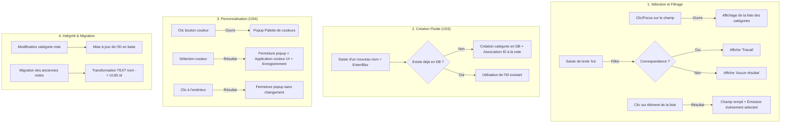

# Plan de Tests — Sélecteur de catégories intuitif

## 1. Objectif
L'objectif de ce plan de tests est de garantir le bon fonctionnement du nouveau système de gestion des catégories. Il s'agit de valider la transition d'un modèle de saisie textuelle libre vers un système de sélection assistée (Autocomplete/Combobox), la gestion des couleurs et l'intégrité des données lors de la migration du format (Nom $\rightarrow$ ID).

## 2. Flux Logique (Diagramme Cause-Effet)

## 3. Périmètre de tests

### 3.1 Tests Unitaires (Unit Tests)

#### `CategoriesService`
- **`getOrCreate(name: string, color?: string)`** :
    - Vérifier qu'une catégorie est retournée si le nom existe déjà (insensible à la casse et aux espaces).
    - Vérifier qu'une nouvelle catégorie est créée si le nom est réellement nouveau.
    - Vérifier que la couleur est correctement associée lors de la création.
- **CRUD Catégories** :
    - Récupération de la liste complète.
    - Suppression/Modification (si implémenté).

#### `CategorySelectorComponent`
- **Comportement de l'Autocomplete** :
    - Affichage de la liste au focus.
    - Filtrage dynamique de la liste en fonction de la saisie.
    - Gestion du cas "Aucun résultat".
- **Comportement de la Sélection** :
    - Émission de l'événement de sélection lors du clic sur un élément.
    - Mise à jour du champ de saisie avec le nom de la catégorie choisie.
- **Comportement de la Couleur** :
    - Ouverture/Fermeture de la popup de couleur.
    - Application de la couleur sélectionnée sur le composant.
    - Fermeture de la popup lors d'un clic extérieur.

### 3.2 Tests d'Intégration

#### Flux Note $\leftrightarrow$ Catégorie
- **`NoteEditor` $\leftrightarrow$ `CategorySelector`** : Vérifier que la sélection dans le composant met à jour l'objet `Note` dans le formulaire de l'éditeur.
- **`NotesService` $\leftrightarrow$ `CategoriesService`** : Vérifier que la résolution `Nom $\rightarrow$ ID` se fait correctement lors de l'enregistrement de la note.

### 3.3 Tests de Bout-en-Bout (E2E / Scénarios Utilisateurs)

| ID | Scénario | Action Utilisateur | Résultat Attendu |
|---|---|---|---|
| **E2E-1** | **Sélection simple** | Cliquer dans le champ catégorie, choisir "Travail" dans la liste. | Le champ affiche "Travail", le contour est coloré (si une couleur est définie). |
| **E2E-2** | **Création fluide** | Taper "Projet Perso" (inexistant) et valider la note. | La note est enregistrée, une nouvelle catégorie "Projet Perso" apparaît dans la liste des catégories. |
| **E2E-3** | **Anti-doublon** | Taper "travail " (minuscule + espace) alors que "Travail" existe. | Le système utilise l'ID de la catégorie "Travail" existante. |
| **E2E-4** | **Personnalisation** | Changer la couleur de la catégorie "Urgent" via la popup. | La couleur est persistée et affichée sur toutes les notes de cette catégorie. |

### 3.4 Tests de Migration (Critique)

- **Migration de données (Legacy to New)** :
    - **Scénario :** Une base de données contient une note avec `category: "Personnel"`.
    - **Action :** Lancement du processus de migration.
    - **Résultat attendu :** La table `categories` contient une entrée "Personnel", et la note possède désormais l'ID correspondant dans sa colonne `category_id` (ou équivalent).
- **Intégrité de l'affichage :**
    - Vérifier que la `NoteList` affiche toujours le **nom** de la catégorie (et non l'UUID) après la migration.

## 4. Données de test (Test Data)
- Un jeu de données de test avec :
    - Des notes avec des catégories textuelles existantes.
    - Des notes avec des catégories avec des fautes de frappe/casse (pour tester le `NOCASE`).
- Une palette de couleurs standardisée pour les tests de UI.

## 5. Risques identifiés
- **Régression UI** : Erreur d'affichage si l'ID est utilisé au lieu du nom dans les composants de liste.
- **Perte de données** : Échec de la migration transformant les noms en ID.
- **Doublons** : Échec de la normalisation (ex: "Test" et "test" créant deux catégories distinctes).
