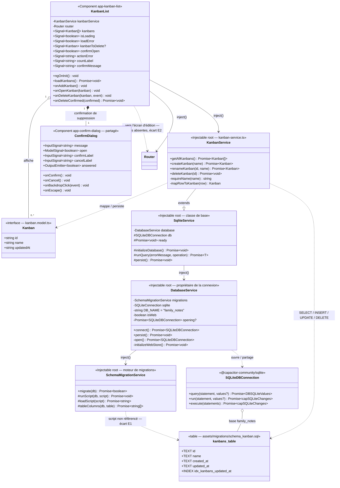

# Diagramme de classes — Fonctionnalité « Kanban »

> Vision de la fonctionnalité **Kanban — gestion (CRUD) des tableaux** : le modèle du domaine
> `Kanban`, la source de données `KanbanService` et l'écran de liste `KanbanList`, posés sur la
> **couche base partagée** (`SqliteService` / `DatabaseService` / `SchemaMigrationService`) dont ce
> lot est le premier réutilisateur après les notes. Créé le 2026-10-10 sur le code livré de la
> branche `kanban` (lot 1 « service » + lot 2 « liste », groupes 6 à 11 verts).
>
> Documents liés : la **SPEC** [`KANBAN/CRUD/FEATURE_KANBAN_CRUD.md`](KANBAN/CRUD/FEATURE_KANBAN_CRUD.md),
> l'**approche** [`KANBAN/CRUD/APPROCHE_KANBAN_CRUD.md`](KANBAN/CRUD/APPROCHE_KANBAN_CRUD.md)
> (diagramme *prévu*, décisions `D-K#`), le **plan de test**
> [`KANBAN/CRUD/PLAN_TESTS_KANBAN_CRUD.md`](KANBAN/CRUD/PLAN_TESTS_KANBAN_CRUD.md) et la **revue**
> [`KANBAN/CRUD/REVUE_KANBAN_CRUD.md`](KANBAN/CRUD/REVUE_KANBAN_CRUD.md) (constats `C#`).
> Vue **sœur** de [`DIAGRAMME_CLASSES_NOTES.md`](DIAGRAMME_CLASSES_NOTES.md) : les deux domaines ne
> partagent que `SqliteService` et `ConfirmDialog`, d'où un document séparé (décidé avec
> l'utilisateur le 2026-10-10).
>
> Le bloc ci-dessous est un diagramme Mermaid `classDiagram` : il se rend directement dans un
> aperçu Markdown compatible Mermaid (VS Code + extension, GitHub, etc.).

## 1. Diagramme



## 2. Lecture des relations

| Relation | Signification |
|---|---|
| `KanbanService --\|> SqliteService` (héritage) | Le service **n'ouvre aucune connexion** : il hérite de `db`, du garde `ready`, du wrapper `runQuery` et du flush `persist`. Chaque méthode publique n'est donc qu'une requête SQL enveloppée dans `runQuery('<message>', …)` ([kanban-service.ts:24](../frontend/src/app/core/services/kanban-service.ts:24)). |
| `SqliteService --> DatabaseService` | La connexion est **partagée** par toutes les sources de données : `DatabaseService.connect()` l'ouvre à la première demande, d'où qu'elle vienne, et les suivantes réutilisent la même promesse (`opening`). |
| `DatabaseService --> SchemaMigrationService` | À l'ouverture, la base déjà installée sur l'appareil est mise au schéma courant en jouant des scripts `.sql` des assets — le SQL n'est **jamais** dupliqué en TypeScript (mémoire projet `db-migrations-in-sql-assets`). |
| `SchemaMigrationService ..> schema_kanban.sql` | Lien **prévu mais pas réalisé** : le script existe dans les assets, rien ne l'exécute. Voir l'**écart E1** au §5. |
| `KanbanService ..> Kanban` | `mapRowToKanban` convertit une ligne `kanbans` en modèle : `created_at` reste en base, seule `updated_at` est exposée (`D-K1`). `requireName` rejette un nom vide **avant** de toucher la base. |
| `KanbanList --> KanbanService` | La page **injecte** le service et ne l'appelle que pour deux choses : `getAllKanbans` au chargement, `deleteKanban` après confirmation. Depuis la révision de `D-K2`/`D-K3`, elle ne porte **aucun formulaire** : `createKanban` et `renameKanban` existent dans le service mais **personne ne les appelle encore** (c'est l'écran d'édition, lot 3, qui le fera). |
| `KanbanList o-- Kanban` (agrégation 0..*) | Le signal `kanbans` porte la liste affichée, triée du plus récemment modifié au plus ancien par le `ORDER BY updated_at DESC` du service. |
| `KanbanList *-- ConfirmDialog` (composition) | La page **imbrique** la popup partagée de la page « Mes Notes », sans la modifier : elle pousse `[message]`, lie `[(open)]` à son signal `confirmOpen` et reçoit la réponse via `(answered)` → `onDeleteConfirmed`. |
| `KanbanList --> Router` | La liste **navigue** vers l'écran d'édition — `/kanban/new` depuis « + », `/kanban/edit/:id` depuis une carte — sans rien écrire (`D-K11`). Ces routes ne sont pas encore déclarées : **écart E2** au §5. |

## 3. Cycle CRUD (parcours des couches)

```
KanbanList (UI, signals)
   │  loadKanbans · onAddKanban · onOpenKanban · onDeleteKanban → onDeleteConfirmed
   │  (ConfirmDialog entre la demande et la suppression)
   ▼
KanbanService (Injectable root)
   │  getAllKanbans · createKanban · renameKanban · deleteKanban
   │  requireName (nom obligatoire) ⇄ mapRowToKanban (ligne → modèle)
   ▼
SqliteService (classe de base)
   │  runQuery : await ready → opération → log + rethrow      ·      persist : flush web
   ▼
DatabaseService  ──►  SchemaMigrationService (scripts assets/migrations/*.sql)
   │  connexion partagée "family_notes"
   ▼
SQLite (@capacitor-community/sqlite)
   table kanbans(id, name, created_at, updated_at) + index idx_kanbans_updated_at
```

> **Écritures et rafraîchissement** : la liste n'est mise à jour qu'**après succès en base**
> (`D-K7`). La suppression retire la carte **sur place** (`kanbans.update(filter)`) au lieu de
> relancer `getAllKanbans` : un aller-retour de moins et pas de clignotement. Un échec laisse la
> carte à l'écran et renseigne le bandeau `actionError`.

## 4. Notes de conception

- **Un tableau n'a pas de description** (`D-K1`) : `Kanban` se limite à `id`, `name`, `updatedAt`.
  La date de création vit en base mais n'est pas exposée par le modèle.
- **Pas d'unicité du nom** (`D-K4`) : aucune contrainte en base, aucun contrôle dans le service —
  deux tableaux peuvent porter le même nom. Le seul contrôle est « non vide après `trim` », tenu à
  la fois par le `CHECK (length(trim(name)) > 0)` du script SQL et par `requireName`, qui refuse
  avant toute écriture.
- **Suppression idempotente** : `deleteKanban` d'un tableau déjà disparu n'est **pas** une erreur
  (l'état final est celui demandé). `renameKanban`, lui, **lève** `Kanban introuvable` quand aucune
  ligne n'a été touchée, et ne sauvegarde alors rien.
- **Deux états d'erreur distincts dans la page** : `loadError` remplace la liste par un état plein
  écran avec un bouton « Réessayer » (US1) ; `actionError` est un **bandeau non bloquant** affiché
  au-dessus de la liste après un échec de suppression, remis à zéro au début de chaque nouvelle
  action pour qu'un message ne soit jamais lu comme portant sur le tableau suivant.
- **Clic sur la corbeille arrêté** (`event.stopPropagation()`) : l'icône est **dans** la carte,
  dont le clic ouvre l'écran d'édition — sans cela l'écran s'ouvrirait derrière la popup.
- **Libellés calculés** : `countLabel` (« Aucun tableau » / « 1 tableau » / « N tableaux ») et
  `confirmMessage` (qui **nomme** le tableau visé) sont des `computed`, donc toujours cohérents avec
  `kanbans()` et `kanbanToDelete()`.

## 5. Écarts code ↔ plans relevés

> Les écarts E2 à E4 pointent tous vers le **lot 3** (écran d'édition du tableau), dont la SPEC
> [`KANBAN/EDITION/FEATURE_KANBAN_EDITION.md`](KANBAN/EDITION/FEATURE_KANBAN_EDITION.md) vient
> d'être rédigée (2026-10-10) mais dont **aucun code n'est livré** : rien de ce lot ne figure
> donc dans le diagramme ci-dessus.

| # | Écart | État réel |
|---|---|---|
| **E1** | **La table `kanbans` n'est créée par personne.** L'APPROCHE prévoyait `KanbanService.ensureSchema()` (`D-K6`) ; la livraison a préféré un script d'assets, `assets/migrations/schema_kanban.sql`, et l'en-tête du service l'annonce comme « créée par `SchemaMigrationService` ». Mais `SchemaMigrationService` ne connaît que trois scripts (`categories`, `notes`, `relationalCategories`) : **`schema_kanban.sql` n'est référencé nulle part dans le code** ([schema-migration.service.ts:12-21](../frontend/src/app/core/services/schema-migration.service.ts:12)). Le lot ne fonctionne donc aujourd'hui que sur une base où la table a été créée à la main (`scripts/seed_kanbans.sql`) ou copiée du seed des assets. La revue (`C10`) décrit l'intention, pas l'état du code. | `ensureSchema` **n'existe pas** ; le script existe mais **n'est jamais joué**. Le diagramme porte donc ce lien en pointillé annoté. |
| **E2** | **Les routes de l'écran d'édition n'existent pas.** `onAddKanban` et `onOpenKanban` naviguent vers `/kanban/new` et `/kanban/edit/:id` (`D-K12`), mais `app.routes.ts` ne déclare que `kanban` : dans l'application réelle, « + » et un clic sur une carte tombent sur `path: '**'` et renvoient l'utilisateur sur « Mes Notes ». Conséquence assumée du découpage (l'écran d'édition est le lot 3) ; les tests restent verts car ils espionnent le `Router`. Déjà relevé en revue (`C11`). | Navigation **émise** mais sans cible. Le commentaire de `app.routes.ts:27` décrit encore la popup de `D-K2` **avant** sa révision du 2026-10-07 (`C12`). |
| **E3** | **`createKanban` / `renameKanban` sont livrés mais inutilisés.** Le service porte les deux écritures (testées), aucun appelant ne les invoque : la liste ne les appelle plus depuis la révision de `D-K2`/`D-K3`, et leur appelant prévu est l'écran d'édition du lot 3. | Code **mort pour l'instant**, volontairement. Le diagramme les conserve : ils existent et sont couverts par les tests. |
| **E4** | **Pas de lecture unitaire** : aucun `getKanbanById(id)`, dont `/kanban/edit/:id` aura besoin. Déjà noté en revue (`C14`) comme traçabilité pour le lot suivant, à écrire en TDD. | Absent du code, donc **absent du diagramme**. |
