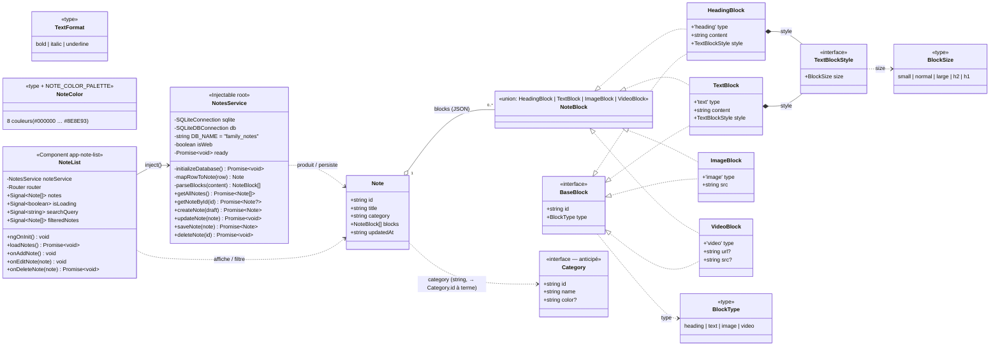
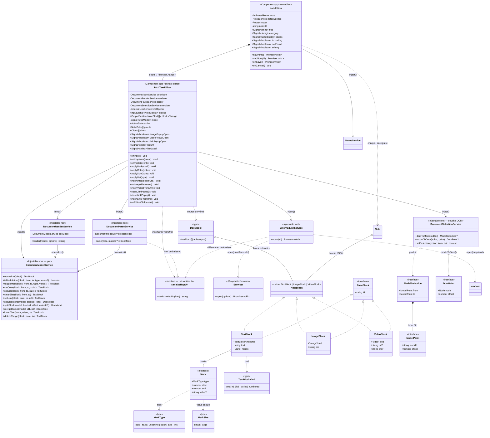

# Diagramme de classes — Fonctionnalité « Notes »

> Vision globale de la fonctionnalité Note (modèles du domaine, service d'accès aux
> données, composant de liste). Créé le 2026-09-08. Complète `MODELE_DONNEES_NOTES.md`
> (détail des modèles) et `PLAN_NOTES.md` (architecture par blocs / CRDT).
>
> Le bloc ci-dessous est un diagramme Mermaid `classDiagram` : il se rend directement
> dans un aperçu Markdown compatible Mermaid (VS Code + extension, GitHub, etc.).

## 1. Diagramme



## 2. Lecture des relations

| Relation | Signification |
|---|---|
| `Note o-- NoteBlock` (agrégation, 0..*) | Une note contient une liste ordonnée de blocs, sérialisée en JSON dans `notes.content`. |
| `NoteBlock <|.. Heading/Text/Image/Video` | Union discriminée sur `type` — chaque variante réalise le contrat `NoteBlock`. |
| `BaseBlock <|.. …` | Chaque bloc hérite des champs communs `id` (UUID) + `type`. |
| `Block *-- TextBlockStyle` (composition) | `HeadingBlock` et `TextBlock` embarquent leur style structurel (`size`). |
| `Note ..> Category` (dépendance) | `category` est aujourd'hui une **chaîne** ; pointera vers `Category.id` quand la table existera (anticipé — voir `MODELE_DONNEES_NOTES.md` §5). |
| `NoteList --> NotesService` | Le composant **injecte** le service (`inject(NotesService)`) et l'appelle pour charger/supprimer. |
| `NotesService ..> Note` | Le service mappe les lignes SQLite ⇄ `Note` et (dé)sérialise les blocs. |

## 3. Cycle CRUD (parcours des couches)

```
NoteList (UI, signals)
   │  loadNotes / onDeleteNote / onAddNote / onEditNote
   ▼
NotesService (Injectable)
   │  getAllNotes · getNoteById · createNote · updateNote · deleteNote
   │  mapRowToNote ⇄ parseBlocks  (JSON.parse/stringify des blocs)
   ▼
SQLite (@capacitor-community/sqlite, base "family_notes")
   table notes(id, title, content JSON, category, updated_at)
```

## 4. Notes de conception

- **Formatage inline** (gras/italique/souligné/couleur) : appliqué en **HTML** dans le
  `content` des blocs texte, pas comme structure persistée à part. `TextFormat` et
  `NoteColor`/`NOTE_COLOR_PALETTE` décrivent donc les *options* de la barre d'outils.
- **`saveNote` legacy** : n'écrit encore que `id, title` — à fusionner avec
  `createNote`/`updateNote` (cf. mémoire projet « écarts NotesService »).
- **`Category`** : modèle **anticipé**. La table `categories` et sa migration ne sont
  pas encore créées ; `Note.category` reste une colonne `TEXT`.
- **UUID par bloc** : prérequis de la future synchronisation CRDT (`PLAN_NOTES.md`).

---

## 5. Diagramme — Fonctionnalité « note-editor »

> Vision de la fonctionnalité **édition de note** (écran éditeur, éditeur riche et les quatre services
> du modèle document JSON). Ajouté le 2026-09-16, sur le **modèle pivot réel**
> `document.model.ts` (décidé le 2026-09-15, cf. `PLAN_MODELE_DOCUMENT_JSON.md`) — celui que
> `Note.blocks` utilise désormais. Diagramme **distinct** des sections 1–4 : voir la note de
> conception §8 sur le rapport avec l'ancien modèle de blocs.
>
> **Mis à jour le 2026-09-19** — fonctionnalité **insertion de lien** (`.agent/URL_LINK/`,
> cf. `REVUE_INSERTION_LIEN.md`) : marque inline `link` (URL portée par `Mark.value`), service
> d'ouverture externe `ExternalLinkService` et point unique de sanitation `sanitizeHttpUrl`.
> Ajouts intégrés **dans ce même diagramme** (delta sur les classes existantes, pas de sous-système
> séparé).



> **Gardes de type** (`document.model.ts`) : `isTextBlock` / `isImageBlock` / `isVideoBlock` /
> `isVoidBlock` discriminent l'union `NoteBlock` sur `kind` (rendu dynamique + mapping de sélection).
> Les helpers **privés** de `RichTextEditor` (`commit`, `paint`, `mutateSelectedBlock`,
> `selectedRange`, `insertBlock`, `refreshActive`…) orchestrent le cycle décrit au §7 et ne sont pas
> exposés.
>
> **Marque `link` (URL_LINK)** : la valeur d'une marque `link` est l'URL `http(s)` (`Mark.value`),
> comme `color`/`size`. Le rendu/parsing de la marque passe par des helpers **privés** :
> `DocumentRenderService.tagFor` (cas `link` → `<a href target=_blank rel=noopener noreferrer>`) et
> `DocumentParseService.marksForElement` (balise `A` → marque `link` sanitée). L'ordre d'imbrication
> `TYPE_ORDER` (dupliqué **privé** dans model **et** render, à faire évoluer ensemble) place `link`
> comme balise **la plus externe**. `sanitizeHttpUrl` est le **point unique** de filtrage des schémas
> (`http`/`https` seuls), appelé au parse, à l'insertion et à l'ouverture.

## 6. Lecture des relations (note-editor)

| Relation | Signification |
|---|---|
| `NoteEditor *-- RichTextEditor` | L'écran éditeur **imbrique** l'éditeur riche : il pousse les blocs initiaux via `[blocks]` et reçoit les blocs courants via `(blocksChange)`. Tout le formatage et l'insertion média vivent dans `RichTextEditor`. |
| `NoteEditor --> NotesService` | Charge (`getNoteById`), crée (`createNote`) et met à jour (`updateNote`) la note ; navigue vers `/notes` au succès (D3). |
| `RichTextEditor --> Document*Service` | L'éditeur **injecte** les 4 services : `document-model` (algèbre pure), `document-render` (modèle → HTML), `document-parse` (HTML → modèle), `document-selection` (mapping DOM ⇄ modèle). |
| `RichTextEditor ..> DocModel` | La **source de vérité est le tableau `blocks`** ; le `contenteditable` n'est qu'un écran rendu depuis le modèle et re-dérivé à la saisie. |
| `DocumentRender/Parse --> DocumentModelService` | Rendu et parsing **normalisent** chaque bloc via le service pur (marques triées, fusionnées, bornées) → aller-retour `parse(render(m)) == m`. |
| `DocModel o-- NoteBlock` (agrégation) | Le document est un tableau **plat** de blocs ; les `<ul>`/`<ol>` sont reconstitués au rendu à partir des items consécutifs (D9). |
| `TextBlock o-- Mark` (agrégation) | Le formatage inline est stocké comme **intervalles plats `[start, end)`** en offsets UTF-16, jamais imbriqués ; le nesting des balises est calculé au rendu (D4/D7). |
| `Note o-- NoteBlock` | Même agrégation qu'en §1, mais sur le **vrai** modèle `document.model.ts` (cf. note §8). |
| `RichTextEditor --> ExternalLinkService` | Le tap sur un `<a>` (`onEditorClick`) délègue l'ouverture externe au service ; l'ouverture est **inconditionnelle** (focus ou non — décision `DL`/APPROCHE §0.3). |
| `RichTextEditor ..> sanitizeHttpUrl` | `insertLinkFromUrl` sanite l'URL saisie (no-op si vide/schéma refusé) puis pose la marque `link` sur le libellé inséré au curseur (repli libellé = URL). |
| `DocumentParseService ..> sanitizeHttpUrl` | Le parsing d'une balise `<a>` ne garde la marque `link` que si `href` est un `http(s)` valide ; sinon la balise est dégrafée (texte conservé, marque droppée). |
| `ExternalLinkService ..> Browser / window` | Ouvre l'URL hors app : `Browser.open` sur natif (Capacitor), repli `window.open(url, '_blank', 'noopener')` en web (dev), après re-sanitation (défense en profondeur). |

## 7. Cycle d'édition (commande → modèle → écran)

```
RichTextEditor (toolbar / clavier)
   │  applyMark · applyColor · applySize · applyList · onKeydown (Enter/Backspace) · onPaste
   ▼
DocumentModelService (pur, immuable)
   │  toggleMark · setColor · setSize · splitBlock · mergeBlocks · deleteRange …
   ▼
nouveau DocModel  ──►  DocumentRenderService.render(model, {withBlockIds})
   │                        (modèle → HTML, tag data-block-id par bloc)
   ▼
contenteditable repeint  ──►  DocumentSelectionService.setSelection(...)
   │                              (restaure le curseur au même endroit)
   ▼
blocksChange.emit(model)  ──►  NoteEditor.blocks  ──►  NotesService.updateNote/createNote
                                                          (JSON.stringify des blocs)
```

> Saisie libre (`onInput`) : le modèle est **re-dérivé du DOM** via `DocumentParseService.parse`
> (les `data-block-id` préservent l'identité des blocs) **sans** repeindre, pour ne pas faire sauter
> le curseur ; seule la saisie structurelle (Entrée / Retour arrière) passe par les commandes pures.

## 8. Note de conception — deux modèles de blocs

Les sections 1–4 décrivent le modèle de blocs **historique**
([note-block.model.ts](../frontend/src/app/core/models/note-block.model.ts) : `HeadingBlock` /
`TextBlock` avec `content: string` + `TextBlockStyle`, `type` = heading|text|image|video). Il s'agit
de la vue **pré-pivot** (2026-09-08).

La fonctionnalité **note-editor** a introduit le modèle pivot
[document.model.ts](../frontend/src/app/core/models/document.model.ts) (2026-09-15), qui **remplace**
le HTML inline par un couple `text` (texte nu) + `marks` (intervalles) et fusionne la « taille titre »
dans le `kind` du bloc (`h1`/`h2`). C'est **ce** modèle que `Note.blocks` utilise réellement
aujourd'hui. Les deux diagrammes décrivent donc **deux époques** ; la réconciliation de la Section 1
sur `document.model.ts` reste à faire (hors périmètre de cet ajout).
