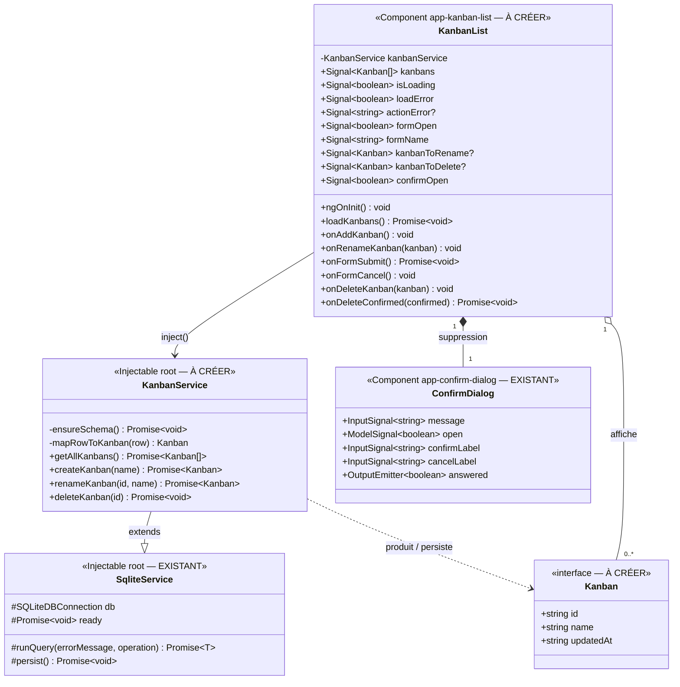

# Approche de développement — Kanban : gestion (CRUD) des tableaux

> **Date :** 2026-09-29 · **Statut :** brouillon — à valider
> **SPEC :** `.agent/KANBAN/CRUD/FEATURE_KANBAN_CRUD.md` · **Maquette :** `MAQUETTE_KANBAN_LIST.html`
> **Docs de référence :** `.agent/PLAN_GLOBAL.md` §2.C, `.agent/DIAGRAMME_CLASSES_NOTES.md` §1–4,
> `.agent/MODELE_DONNEES_NOTES.md`
> **Code de référence :** `core/services/{sqlite-service,notes-service}.ts`, `note-list/`,
> `core/components/confirm-dialog/`, `app.routes.ts`

---

## 0. Décisions de cadrage (hypothèses de la SPEC tranchées — à valider)

| # | Sujet | Choix proposé |
|---|-------|---------------|
| D-K1 | H1 — attributs d'un kanban | Un identifiant, un nom et une date de dernière modification. **Pas de description.** La base garde aussi une date de création, non affichée. |
| D-K2 | H2 — formulaire | Une **popup** de saisie du nom, utilisée pour la création comme pour le renommage (maquette, écrans 2 et 3). |
| D-K3 | H3 — action « Modifier » | Une **icône crayon** sur chaque carte de la liste (maquette, écran 1). |
| D-K4 | H4 — unicité du nom | **Aucun contrôle** : deux kanbans peuvent porter le même nom. |
| D-K5 | H5 — point d'entrée | La **route `/kanban`** seulement ; pas de menu global dans ce lot. |
| D-K6 | Création de la table | La table est créée **au démarrage du service** si elle n'existe pas. Raison : la base de départ n'est copiée qu'au tout premier lancement, les installations existantes n'auraient donc jamais la table. |
| D-K7 | Mise à jour de la liste | **Après succès en base uniquement**, comme pour la suppression des notes. En cas d'échec, l'écran reste tel quel et un message s'affiche. |
| D-K8 | Affichage de la date | Même format que la page « Mes Notes ». Le libellé relatif de la maquette (« Modifié aujourd'hui / hier / le … ») est une **option** à confirmer (voir Lot 2). |
| D-K9 | Écran de détail (US3) | **Reporté** (décision du 2026-09-29) : ce lot ne livre que la page liste. Voir §5. |

---

## 1. Diagramme de classes

> **Légende :** « EXISTANT » = réutilisé tel quel ; « À CRÉER » = nouveau code. `?` = optionnel.

**Existant réutilisé :** `SqliteService` (connexion à la base, attente d'initialisation, gestion des
erreurs, sauvegarde web) et `ConfirmDialog` (sans modification).
**À créer :** le modèle `Kanban`, le service `KanbanService`, la page `KanbanList`, la route
`/kanban`, et le script de référence `scripts/schema_kanban.sql`.
La popup de saisie du nom est intégrée au gabarit de la page (champs `formOpen` / `formName`).

### Table SQLite `kanbans` (à créer)

| Colonne | Type | Contrainte | Champ `Kanban` |
|---|---|---|---|
| `id` | TEXT | clé primaire | `id` |
| `name` | TEXT | obligatoire, non vide | `name` |
| `created_at` | TEXT | obligatoire, date ISO | — (non exposé) |
| `updated_at` | TEXT | obligatoire, date ISO | `updatedAt` |

Un index sur `updated_at` accélère le tri de la liste.

---

## 2. Lecture des relations

| Relation | Signification |
|---|---|
| `KanbanService` hérite de `SqliteService` | Même principe que `NotesService` : une seule base `family_notes`, chaque requête attend que la base soit prête, chaque écriture est sauvegardée. |
| `KanbanList` utilise `KanbanService` | La page passe par le service pour lire et écrire ; elle ne touche jamais la base directement. |
| `KanbanList` contient `ConfirmDialog` | Même popup de confirmation que pour les notes (US5). |
| `KanbanList` affiche des `Kanban` | La page garde en mémoire la liste chargée et la met à jour après chaque opération réussie. |

---

## 3. Approche de développement

### Règle commune : validation du nom (US2, US4)

Le nom saisi est **nettoyé des espaces en début et en fin**. S'il est vide après ce nettoyage, il
est refusé : le bouton de validation de la popup reste désactivé et le message « Le nom est
obligatoire. » est affiché. Les espaces à l'intérieur du nom sont conservés.

Le service applique la même vérification avant d'écrire en base, par sécurité : un nom vide
provoque une erreur même si l'écran ne l'a pas bloqué.

### Lot 1 — Modèle et persistance : `KanbanService` (US1, US2, US4, US5)

**Préparation de la table.** Au démarrage, le service attend que la connexion à la base soit prête,
puis crée la table `kanbans` et son index s'ils n'existent pas encore, et sauvegarde la base
(indispensable sur le web, sinon la table disparaît au rechargement). Toutes les autres opérations
attendent la fin de cette préparation. L'opération peut être rejouée à chaque lancement sans effet.
Si elle échoue, toutes les opérations échouent et la page affiche son état d'erreur.

**Lire tous les kanbans.** Le service renvoie tous les kanbans, du plus récemment modifié au plus
ancien, en convertissant chaque ligne de la base vers le modèle `Kanban`. S'il n'y en a aucun, il
renvoie une liste vide.

**Créer un kanban.** Le service valide le nom, génère un nouvel identifiant et la date du moment,
enregistre le kanban, sauvegarde la base, puis renvoie le kanban créé.

**Renommer un kanban.** Le service valide le nom, met à jour le nom et la date de modification,
puis sauvegarde. Si aucune ligne n'a été modifiée (kanban supprimé entre-temps), il signale une
erreur « Kanban introuvable ». Il renvoie le kanban à jour, ce qui évite de recharger toute la liste.

**Supprimer un kanban.** Le service supprime le kanban puis sauvegarde. Supprimer un kanban déjà
absent n'est pas une erreur.

*Pour plus tard :* les futures listes et cartes seront rattachées au kanban et supprimées avec lui
(suppression en cascade) — hors de ce lot.

### Lot 2 — Page liste : `KanbanList` (US1, US2, US4, US5) — route `/kanban`

**Affichage et chargement (US1).** À l'ouverture, la page affiche un indicateur de chargement et
appelle `getAllKanbans()`.
- Si tout va bien, elle affiche les kanbans (nom et date de modification), avec le titre
  « Mes Kanbans » et leur nombre.
- S'il n'y en a aucun, elle affiche « Aucun tableau pour l'instant. Touchez « + » pour en créer un. ».
- En cas d'échec, elle affiche un message d'erreur et un bouton « Réessayer » qui relance le chargement.

**Création (US2).** Le bouton « + » ouvre la popup « Nouveau tableau » avec un champ vide.
- « Annuler », un clic hors de la popup ou la touche Échap ferment la popup sans rien créer.
- « Créer » (ou Entrée) valide le nom puis appelle `createKanban()`. En cas de succès, le nouveau
  kanban est ajouté **en tête** de la liste. En cas d'échec, un message « Impossible de créer le
  tableau. » s'affiche.
- À chaque ouverture, le champ repart à zéro : une saisie abandonnée ne réapparaît pas.

**Renommage (US4).** L'icône crayon ouvre la popup « Renommer le tableau », avec le champ pré-rempli
par le nom actuel.
- Si le nom n'a pas changé, la popup se ferme sans rien enregistrer (la date n'est pas modifiée).
- Sinon, la page appelle `renameKanban()`. En cas de succès, le kanban est mis à jour dans la liste,
  qui est retriée : le kanban renommé remonte en tête. En cas d'échec, la liste reste inchangée et
  un message « Impossible de renommer le tableau. » s'affiche.
- « Annuler » laisse le kanban inchangé.

**Suppression (US5).** L'icône corbeille mémorise le kanban visé et ouvre `ConfirmDialog` avec le
message « Supprimer le tableau « <nom> » ? » et les boutons « Annuler » / « Confirmer ».
- Si l'utilisateur annule (bouton, clic hors de la popup, Échap), rien n'est supprimé.
- S'il confirme, la page appelle `deleteKanban()`. En cas de succès, le kanban est retiré de la liste.
  En cas d'échec, il reste affiché et un message « Impossible de supprimer le tableau. » s'affiche.

**Messages d'erreur.** Les erreurs de création, renommage et suppression s'affichent dans un bandeau
non bloquant, effacé au début de l'action suivante. C'est un écart volontaire avec la page
« Mes Notes », qui se contente d'écrire l'erreur dans la console : la SPEC demande un message visible.

**Option D-K8 (si validée).** Afficher la date sous la forme « Modifié aujourd'hui », « Modifié hier »
ou « Modifié le jj/mm/aaaa ». La comparaison se fait sur le jour du calendrier local (et non sur un
écart de 24 h), pour rester juste autour de minuit et des changements d'heure.

### Lot 3 — Routage

Ajouter la route `/kanban` dans `app.routes.ts`, **avant** la route « toute adresse inconnue » qui
redirige vers les notes. Il n'y a pas de route de création : la création se fait dans une popup.

---

## 4. Impacts et points d'attention

- **Installations existantes** : la table est créée au démarrage (D-K6). Le script
  `scripts/schema_kanban.sql` sert de documentation ; régénérer la base de départ est facultatif.
- **Connexion partagée** : `KanbanService` est un service distinct de `NotesService`, mais utilise
  la même base. Il faut vérifier qu'ouvrir une deuxième connexion sur la même base ne provoque pas
  d'erreur « connexion déjà existante » (la situation existe déjà avec `NotesService` et
  `CalendarService`). Sinon, récupérer la connexion déjà ouverte.
- **Cartes non cliquables pour l'instant** : sans écran de détail, toucher une carte ne fait rien.
  Quand le détail arrivera, le clic sur le crayon et la corbeille ne devra pas se propager à la carte.
- **Pas de régression sur les notes** : seuls `app.routes.ts` et l'export des modèles
  (`core/models/index.ts`) sont modifiés parmi les fichiers existants.
- **Accessibilité** : libellés accessibles « Renommer », « Supprimer », « Nouveau tableau » ; la popup
  de saisie se comporte comme `ConfirmDialog` (fenêtre modale, Échap, clic hors de la popup).

---

## 5. Découpage suggéré

| Ordre | Lot | Dépend de | US servies | Ce qu'il faudra tester (→ `plan_test`) |
|---|---|---|---|---|
| 1 | Modèle + `KanbanService` | — | US1, US2, US4, US5 | création de la table, tri, validation du nom, kanban introuvable |
| 2 | Page liste + route | 1 | US1, US2, US4, US5 | chargement / vide / erreur, popup de saisie, mise à jour après succès, confirmation de suppression |

**Reporté (D-K9)** : **US3 — écran de détail d'un kanban** (ouverture depuis la liste, retour,
identifiant inexistant). La SPEC `FEATURE_KANBAN_CRUD.md` devra être alignée sur ce report.

**Hors périmètre de ce lot** : listes et cartes, glisser-déposer, recherche / tri / filtre, couleurs
ou catégories de tableau, menu de navigation global, synchronisation CRDT / P2P, pilotage par l'IA.
