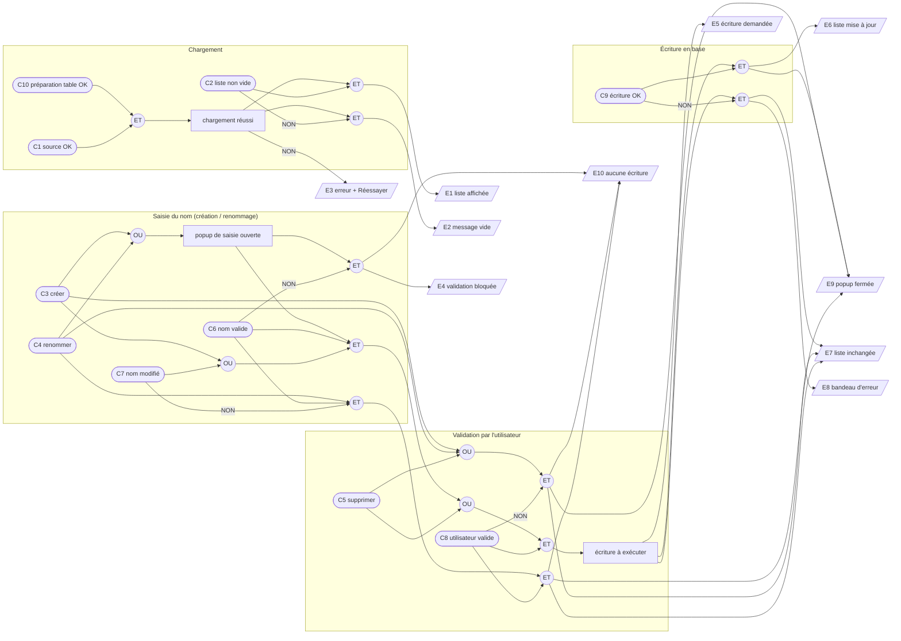

# Plan de test (TDD) — Kanban : gestion (CRUD) des tableaux

## 1. Introduction

> **Date :** 2026-09-29 · **Statut :** brouillon — à valider
> **SPEC :** [`FEATURE_KANBAN_CRUD.md`](FEATURE_KANBAN_CRUD.md) · **Approche :**
> [`APPROCHE_KANBAN_CRUD.md`](APPROCHE_KANBAN_CRUD.md) · **Maquette :**
> [`MAQUETTE_KANBAN_LIST.html`](MAQUETTE_KANBAN_LIST.html)
> **Jumeaux :** `note-list/note-list.spec.ts` (page), `core/services/notes-service.spec.ts` (service)

Approche **boîte noire / TDD** : ce plan décrit le comportement attendu avant toute
implémentation. Il couvre deux objets, testés chacun dans leur propre `.spec.ts` :

- **A — `KanbanService`** : persistance locale des tableaux (préparation de la table, lecture,
  création, renommage, suppression), plugin SQLite simulé.
- **B — page `KanbanList`** (route `/kanban`) : liste des tableaux, popup de saisie du nom,
  confirmation de suppression, états chargement / vide / erreur ; source de données simulée,
  `ConfirmDialog` réel piloté par le DOM.

Hors périmètre : écran de détail (US3, reportée — D-K9), listes et cartes, glisser-déposer,
recherche / tri / filtre, libellé de date relatif (D-K8 : la date est seulement vérifiée non vide,
comme pour « Mes Notes »).

Les cas de test (§3) sont **dérivés du graphe cause-effet et de sa table de décision** (§2) : chaque
colonne `R#` de la table produit au moins un cas `T#`, et chaque cas cite la ou les colonnes qu'il
couvre.

---

## 2. Graphe cause-effet et table de décision

### Causes

| # | Cause (condition d'entrée) |
|---|---|
| C1 | La source de données renvoie la liste sans erreur |
| C2 | La liste contient au moins un tableau |
| C3 | L'utilisateur déclenche **Créer** (bouton « + ») |
| C4 | L'utilisateur déclenche **Renommer** (icône crayon) |
| C5 | L'utilisateur déclenche **Supprimer** (icône corbeille) |
| C6 | Le nom saisi est non vide après retrait des espaces de début / fin |
| C7 | Le nom saisi (nettoyé) diffère du nom actuel |
| C8 | L'utilisateur valide (Créer / Enregistrer / Entrée / Confirmer) plutôt qu'annuler (Annuler, clic hors popup, Échap) |
| C9 | L'opération d'écriture réussit en base |
| C10 | La préparation de la table `kanbans` réussit au démarrage du service |

### Effets

| # | Effet (résultat observable) |
|---|---|
| E1 | La liste des tableaux est affichée (nom + date, titre « Mes Kanbans » + compteur) |
| E2 | Le message « Aucun tableau pour l'instant. Touchez « + » pour en créer un. » est affiché |
| E3 | Un message d'erreur de chargement et un bouton « Réessayer » sont affichés |
| E4 | Le bouton de validation est désactivé et « Le nom est obligatoire. » est affiché |
| E5 | L'écriture est demandée avec les bonnes données (nom nettoyé / bon identifiant) |
| E6 | La liste est mise à jour : ajout en tête / renommé remonté en tête / retiré |
| E7 | La liste reste inchangée |
| E8 | Un bandeau d'erreur d'action est affiché (« Impossible de créer / renommer / supprimer le tableau. ») |
| E9 | La popup (saisie ou confirmation) est fermée |
| E10 | Aucune écriture : aucun appel d'écriture au service, aucune requête d'écriture en base |

### Graphe

**Contraintes entre causes :**
- **E (exclusion)** — C3, C4, C5 : une seule action à la fois.
- **R (requiert)** — C7 n'a de sens qu'avec C4 (renommage) ; C2 requiert C1.
- **M (masque)** — NON C10 force NON C1 et NON C9 : si la table n'a pas pu être préparée, la lecture
  comme toute écriture échouent.

### Table de décision

Légende : `V` vraie · `F` fausse · `–` indifférente / sans objet · `X` effet attendu · vide = effet absent.
Pour les colonnes d'action (R5–R16), C10 et C1 sont vraies ; C2 est vraie pour renommer / supprimer.

| | R1 | R2 | R3 | R4 | R5 | R6 | R7 | R8 | R9 | R10 | R11 | R12 | R13 | R14 | R15 | R16 |
|---|---|---|---|---|---|---|---|---|---|---|---|---|---|---|---|---|
| **C10** préparation OK | F | V | V | V | V | V | V | V | V | V | V | V | V | V | V | V |
| **C1** source OK | – | F | V | V | V | V | V | V | V | V | V | V | V | V | V | V |
| **C2** liste non vide | – | – | F | V | – | – | – | – | V | V | V | V | V | V | V | V |
| **C3** créer | – | – | – | – | V | V | V | V | F | F | F | F | F | F | F | F |
| **C4** renommer | – | – | – | – | F | F | F | F | V | V | V | V | V | F | F | F |
| **C5** supprimer | – | – | – | – | F | F | F | F | F | F | F | F | F | V | V | V |
| **C6** nom valide | – | – | – | – | – | F | V | V | – | F | V | V | V | – | – | – |
| **C7** nom modifié | – | – | – | – | – | – | – | – | – | – | F | V | V | – | – | – |
| **C8** utilisateur valide | – | – | – | – | F | – | V | V | F | – | V | V | V | F | V | V |
| **C9** écriture OK | – | – | – | – | – | – | V | F | – | – | – | V | F | – | V | F |
| E1 liste affichée | | | | X | | | | | | | | | | | | |
| E2 message vide | | | X | | | | | | | | | | | | | |
| E3 erreur + Réessayer | X | X | | | | | | | | | | | | | | |
| E4 validation bloquée | | | | | | X | | | | X | | | | | | |
| E5 écriture demandée | | | | | | | X | X | | | | X | X | | X | X |
| E6 liste mise à jour | | | | | | | X | | | | | X | | | X | |
| E7 liste inchangée | | | | | X | | | X | X | | X | | X | X | | X |
| E8 bandeau d'erreur | | | | | | | | X | | | | | X | | | X |
| E9 popup fermée | | | | | X | | X | | X | | X | X | | X | X | |
| E10 aucune écriture | | | | | X | X | | | X | X | X | | | X | | |
| **Cas dérivés** | T1.3 | T7.2 T7.3 | T2.3 T7.1 | T1.1 T1.2 T2.1 T2.2 T6.1–T6.5 | T8.1 T8.5 T8.7 | T3.4 T8.2 | T3.1 T3.2 T3.3 T3.5 T8.3 T8.4 T8.6 | T8.8 T11.1 | T9.1 T9.5 | T4.2 T9.2 | T9.3 | T4.1 T4.4 T9.4 | T4.3 T9.6 T11.1 | T10.1 T10.4 | T5.1 T5.2 T10.2 T10.3 | T10.5 T11.1 |

> En cas d'échec d'écriture (R8, R13, R16), la fermeture de la popup n'est pas spécifiée par la SPEC
> ni par l'approche : E9 n'est volontairement pas asserté.

---

## 3. Cas de test

Chaque cas décrit un comportement observable ; entre parenthèses : user story et colonne(s) `R#`.

### Partie A — `KanbanService`

#### Groupe 1 — Préparation de la table
- **T1.1** Avant la première opération, la table `kanbans` et son index sont créés s'ils n'existent
  pas (création idempotente, rejouable à chaque lancement). *(US1 · R4)*
- **T1.2** La base est sauvegardée après la préparation de la table. *(US1 · R4)*
- **T1.3** Si la préparation échoue, la lecture comme les écritures sont rejetées. *(US1 · R1)*

#### Groupe 2 — Lecture des tableaux
- **T2.1** Les tableaux sont renvoyés du plus récemment modifié au plus ancien. *(US1 · R4)*
- **T2.2** Chaque ligne est convertie en `Kanban` : identifiant, nom, date de modification ; la date
  de création n'est pas exposée. *(US1 · R4)*
- **T2.3** Sans aucune ligne en base, une liste vide est renvoyée. *(US1 · R3)*

#### Groupe 3 — Création
- **T3.1** Le nom est enregistré sans les espaces de début / fin ; les espaces internes sont
  conservés. *(US2 · R7)*
- **T3.2** Le tableau renvoyé porte un identifiant et une date de modification non vides, et le nom
  nettoyé. *(US2 · R7)*
- **T3.3** La base est sauvegardée après l'enregistrement. *(US2 · R7)*
- **T3.4** Un nom vide ou composé uniquement d'espaces est rejeté, sans aucune écriture en base.
  *(US2 · R6)*
- **T3.5** Deux tableaux peuvent porter le même nom (aucun contrôle d'unicité). *(US2 · R7)*

#### Groupe 4 — Renommage
- **T4.1** Le nom (nettoyé) et la date de modification du bon tableau sont mis à jour ; le tableau à
  jour est renvoyé. *(US4 · R12)*
- **T4.2** Un nom vide ou composé uniquement d'espaces est rejeté, sans aucune écriture en base.
  *(US4 · R10)*
- **T4.3** Si aucune ligne n'est modifiée (tableau supprimé entre-temps), l'opération est rejetée
  avec l'erreur « Kanban introuvable ». *(US4 · R13)*
- **T4.4** La base est sauvegardée après le renommage. *(US4 · R12)*

#### Groupe 5 — Suppression
- **T5.1** Le tableau ciblé (bon identifiant) est supprimé, puis la base est sauvegardée.
  *(US5 · R15)*
- **T5.2** Supprimer un identifiant absent n'est pas une erreur. *(US5 · R15)*

### Partie B — page `KanbanList`

#### Groupe 6 — Chargement et affichage
- **T6.1** À l'ouverture, les tableaux sont demandés une seule fois à la source de données.
  *(US1 · R4)*
- **T6.2** Tant que la réponse n'est pas arrivée, un indicateur de chargement est affiché ; il
  disparaît ensuite. *(US1 · R4)*
- **T6.3** Une carte est affichée par tableau, avec son nom et une date non vide. *(US1 · R4)*
- **T6.4** Le titre « Mes Kanbans » et le nombre de tableaux sont affichés. *(US1 · R4)*
- **T6.5** Les cartes sont affichées dans l'ordre fourni par la source (du plus récent au plus
  ancien). *(US1 · R4)*

#### Groupe 7 — Liste vide et erreur de chargement
- **T7.1** Sans aucun tableau, le message « Aucun tableau pour l'instant. Touchez « + » pour en créer
  un. » est affiché, sans carte. *(US1 · R3)*
- **T7.2** Si le chargement échoue, un message d'erreur et un bouton « Réessayer » sont affichés ; ni
  indicateur de chargement, ni liste, ni message « vide ». *(US1 · R2)*
- **T7.3** « Réessayer » relance le chargement ; une fois la source rétablie, la liste s'affiche et
  l'erreur disparaît. *(US1 · R2 → R4)*

#### Groupe 8 — Création
- **T8.1** Le bouton « + » ouvre la popup « Nouveau tableau » avec un champ vide. *(US2 · R5)*
- **T8.2** Avec un nom vide ou composé uniquement d'espaces, le bouton « Créer » est désactivé et
  « Le nom est obligatoire. » est affiché. *(US2 · R6)*
- **T8.3** Valider un nom demande la création avec le nom nettoyé des espaces de début / fin.
  *(US2 · R7)*
- **T8.4** Après une création réussie, le nouveau tableau apparaît **en tête** de la liste et la
  popup se ferme. *(US2 · R7)*
- **T8.5** « Annuler », un clic hors de la popup ou la touche Échap ferment la popup sans demander
  de création ; la liste est inchangée. *(US2 · R5)*
- **T8.6** La touche Entrée dans le champ valide la création comme le bouton « Créer ». *(US2 · R7)*
- **T8.7** Une saisie abandonnée ne réapparaît pas : à la réouverture, le champ est vide. *(US2 · R5)*
- **T8.8** Si la création échoue, la liste reste inchangée et « Impossible de créer le tableau. » est
  affiché. *(US2 · R8)*

#### Groupe 9 — Renommage
- **T9.1** L'icône crayon d'une carte ouvre la popup « Renommer le tableau », pré-remplie avec le nom
  actuel de ce tableau. *(US4 · R9)*
- **T9.2** Avec un nom vide ou composé uniquement d'espaces, le bouton « Enregistrer » est désactivé
  et « Le nom est obligatoire. » est affiché. *(US4 · R10)*
- **T9.3** Valider sans avoir modifié le nom ferme la popup sans demander de renommage ; la date
  n'est pas modifiée. *(US4 · R11)*
- **T9.4** Après un renommage réussi (nom nettoyé transmis avec le bon identifiant), la carte affiche
  le nouveau nom, remonte **en tête** de la liste, et la popup se ferme. *(US4 · R12)*
- **T9.5** « Annuler » (ou clic hors popup / Échap) laisse le tableau inchangé, sans demande de
  renommage. *(US4 · R9)*
- **T9.6** Si le renommage échoue, la liste reste inchangée et « Impossible de renommer le tableau. »
  est affiché. *(US4 · R13)*

#### Groupe 10 — Suppression
- **T10.1** L'icône corbeille ouvre la popup de confirmation dont le message cite le nom du tableau
  (« Supprimer le tableau « <nom> » ? ») ; rien n'est supprimé tant que l'utilisateur n'a pas
  répondu. *(US5 · R14)*
- **T10.2** « Confirmer » demande la suppression du bon tableau (bon identifiant). *(US5 · R15)*
- **T10.3** Après une suppression réussie, le tableau disparaît de la liste. *(US5 · R15)*
- **T10.4** « Annuler » ou un clic hors de la popup la ferment sans demander de suppression ; la
  liste est inchangée. *(US5 · R14)*
- **T10.5** Si la suppression échoue, le tableau reste affiché et « Impossible de supprimer le
  tableau. » est affiché. *(US5 · R16)*

#### Groupe 11 — Bandeau d'erreur d'action
- **T11.1** Après un échec (création, renommage ou suppression), le bandeau d'erreur est effacé dès
  le début de l'action suivante. *(US2, US4, US5 · R8, R13, R16)*
