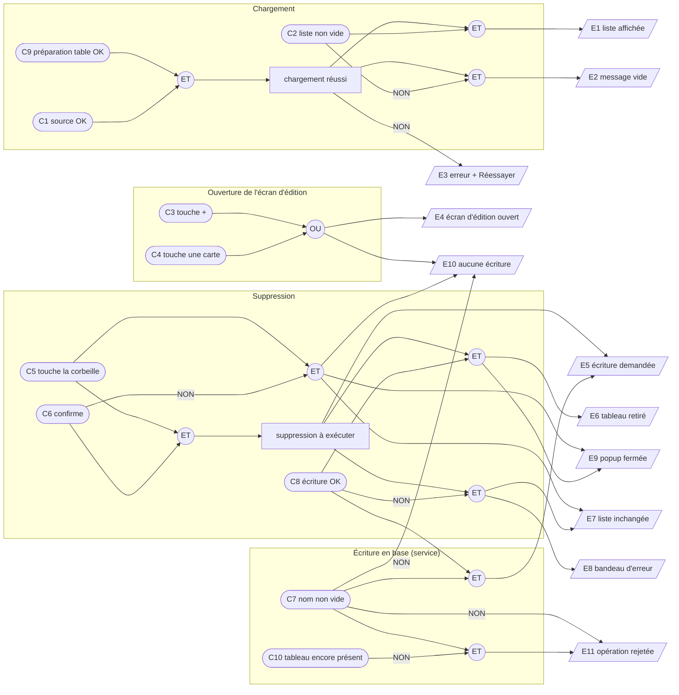

# Plan de test (TDD) — Kanban : gestion (CRUD) des tableaux

## 1. Introduction

> **Date :** 2026-09-29 · **Révisé le :** 2026-10-07 · **Statut :** brouillon — à valider
> **SPEC :** [`FEATURE_KANBAN_CRUD.md`](FEATURE_KANBAN_CRUD.md) · **Approche :**
> [`APPROCHE_KANBAN_CRUD.md`](APPROCHE_KANBAN_CRUD.md) · **Maquette :**
> [`MAQUETTE_KANBAN_LIST.html`](MAQUETTE_KANBAN_LIST.html)
> **Jumeaux :** `note-list/note-list.spec.ts` (page), `core/services/notes-service.spec.ts` (service)

Approche **boîte noire / TDD** : ce plan décrit le comportement attendu avant toute
implémentation. Il couvre deux objets, testés chacun dans leur propre `.spec.ts` :

- **A — `KanbanService`** : persistance locale des tableaux (préparation de la table, lecture,
  création, renommage, suppression), plugin SQLite simulé.
- **B — page `KanbanList`** (route `/kanban`) : liste des tableaux, ouverture de l'écran
  d'édition, confirmation de suppression, états chargement / vide / erreur ; source de données
  simulée, navigation espionnée, `ConfirmDialog` réel piloté par le DOM.

> **Révision du 2026-10-07.** La saisie du nom quitte la popup pour l'écran d'édition du tableau
> (D-K2 et D-K3 révisées). Conséquences sur ce plan : les causes « nom valide » et « nom modifié »
> et l'effet « validation bloquée » disparaissent de la partie B et ne subsistent qu'au niveau du
> service ; un effet « écran d'édition ouvert » apparaît ; le groupe 8 se réduit à l'ouverture d'un
> nouveau tableau, le groupe 9 devient l'ouverture d'un tableau existant, et le groupe 10 gagne un
> cas de non-propagation du clic sur la corbeille, la carte étant maintenant cliquable.
> **La partie A est inchangée** : `createKanban` et `renameKanban` restent au service, c'est
> l'écran d'édition qui les appellera.

Hors périmètre : l'écran d'édition lui-même (US3, livré par le lot suivant — seule la navigation
vers lui est testée ici), listes et cartes, glisser-déposer, recherche / tri / filtre, libellé de
date relatif (D-K8 : la date est seulement vérifiée non vide, comme pour « Mes Notes »).

Les cas de test (§3) sont **dérivés du graphe cause-effet et de sa table de décision** (§2) : chaque
colonne `R#` de la table produit au moins un cas `T#`, et chaque cas cite la ou les colonnes qu'il
couvre.

---

## 2. Graphe cause-effet et table de décision

### Causes

| # | Cause (condition d'entrée) |
|---|---|
| C1 | La source de données renvoie la liste sans erreur |
| C2 | La liste contient au moins un tableau |
| C3 | L'utilisateur touche « + » (nouveau tableau) |
| C4 | L'utilisateur touche une carte (ouvrir un tableau) |
| C5 | L'utilisateur touche la corbeille d'une carte |
| C6 | L'utilisateur confirme la suppression, plutôt que d'annuler (bouton, clic hors popup, Échap) |
| C7 | Le nom transmis au service est non vide après retrait des espaces de début / fin |
| C8 | L'écriture demandée réussit en base |
| C9 | La préparation de la table `kanbans` réussit au démarrage du service |
| C10 | Le tableau visé existe encore en base (renommage) |

### Effets

| # | Effet (résultat observable) |
|---|---|
| E1 | La liste des tableaux est affichée (nom + date, titre « Mes Kanbans » + compteur) |
| E2 | Le message « Aucun tableau pour l'instant. Touchez « + » pour en créer un. » est affiché |
| E3 | Un message d'erreur de chargement et un bouton « Réessayer » sont affichés |
| E4 | L'écran d'édition est ouvert sur la bonne cible : nouveau tableau, ou tableau touché |
| E5 | L'écriture est demandée avec les bonnes données (bon identifiant / nom nettoyé) |
| E6 | La liste est mise à jour : le tableau est retiré |
| E7 | La liste reste inchangée |
| E8 | Le bandeau « Impossible de supprimer le tableau. » est affiché |
| E9 | La popup de confirmation est fermée |
| E10 | Aucune écriture : aucun appel d'écriture au service, aucune requête d'écriture en base |
| E11 | L'opération est rejetée par le service |

### Graphe

**Contraintes entre causes :**
- **E (exclusion)** — C3, C4, C5 : une seule action à la fois.
- **R (requiert)** — C4 et C5 requièrent C2 (il faut une carte à toucher) ; C2 requiert C1 ;
  C6 n'a de sens qu'avec C5 ; C10 n'a de sens qu'au renommage.
- **M (masque)** — NON C9 force NON C1 et NON C8 : si la table n'a pas pu être préparée, la lecture
  comme toute écriture échouent.

### Table de décision

Légende : `V` vraie · `F` fausse · `–` indifférente / sans objet · `X` effet attendu · vide = effet absent.
Pour les colonnes d'action (R5–R9), C9 et C1 sont vraies ; C2 est vraie pour ouvrir ou supprimer.
Les colonnes R10–R12 décrivent le service seul, appelé par la liste (suppression) ou par l'écran
d'édition (création, renommage).

| | R1 | R2 | R3 | R4 | R5 | R6 | R7 | R8 | R9 | R10 | R11 | R12 |
|---|---|---|---|---|---|---|---|---|---|---|---|---|
| **C9** préparation OK | F | V | V | V | V | V | V | V | V | V | V | V |
| **C1** source OK | – | F | V | V | V | V | V | V | V | – | – | – |
| **C2** liste non vide | – | – | F | V | – | V | V | V | V | – | – | – |
| **C3** touche + | – | – | – | – | V | F | F | F | F | – | – | – |
| **C4** touche une carte | – | – | – | – | F | V | F | F | F | – | – | – |
| **C5** touche la corbeille | – | – | – | – | F | F | V | V | V | – | – | – |
| **C6** confirme | – | – | – | – | – | – | F | V | V | – | – | – |
| **C7** nom non vide | – | – | – | – | – | – | – | – | – | F | V | V |
| **C8** écriture OK | – | – | – | – | – | – | – | V | F | – | V | – |
| **C10** tableau présent | – | – | – | – | – | – | – | – | – | – | – | F |
| E1 liste affichée | | | | X | | | | | | | | |
| E2 message vide | | | X | | | | | | | | | |
| E3 erreur + Réessayer | X | X | | | | | | | | | | |
| E4 écran d'édition ouvert | | | | | X | X | | | | | | |
| E5 écriture demandée | | | | | | | | X | X | | X | |
| E6 tableau retiré | | | | | | | | X | | | | |
| E7 liste inchangée | | | | | | | X | | X | | | |
| E8 bandeau d'erreur | | | | | | | | | X | | | |
| E9 popup fermée | | | | | | | X | X | | | | |
| E10 aucune écriture | | | | | X | X | X | | | X | | |
| E11 opération rejetée | X | | | | | | | | | X | | X |
| **Cas dérivés** | T1.3 | T7.2 T7.3 | T2.3 T7.1 | T1.1 T1.2 T2.1 T2.2 T6.1–T6.5 | T8.1 | T9.1 | T10.1 T10.4 T10.6 | T10.2 T10.3 | T10.5 T11.1 | T3.4 T4.2 | T3.1 T3.2 T3.3 T3.5 T4.1 T4.4 T5.1 T5.2 | T4.3 |

> En cas d'échec d'écriture (R9), la fermeture de la popup n'est pas spécifiée par la SPEC ni par
> l'approche : E9 n'est volontairement pas asserté.
>
> Dans les colonnes de suppression (R7–R9), la case E4 vide porte une exigence à part entière
> depuis le 2026-10-07 : toucher la corbeille ne doit **pas** ouvrir l'écran d'édition, la carte
> étant devenue cliquable. T10.6 l'asserte explicitement.

## 3. Cas de test

Chaque cas décrit un comportement observable ; entre parenthèses : user story et colonne(s) `R#`.

### Partie A — `KanbanService`

#### Groupe 1 — Préparation de la table
- **T1.1** Avant la première opération, la table `kanbans` et son index sont créés s'ils n'existent
  pas (création idempotente, rejouable à chaque lancement). *(US1 · R4)*
- **T1.2** La base est sauvegardée après la préparation de la table. *(US1 · R4)*
- **T1.3** Si la préparation échoue, la lecture comme les écritures sont rejetées. *(US1 · R1)*

#### Groupe 2 — Lecture des tableaux
- **T2.1** Les tableaux sont renvoyés du plus récemment modifié au plus ancien. *(US1 · R4)*
- **T2.2** Chaque ligne est convertie en `Kanban` : identifiant, nom, date de modification ; la date
  de création n'est pas exposée. *(US1 · R4)*
- **T2.3** Sans aucune ligne en base, une liste vide est renvoyée. *(US1 · R3)*

#### Groupe 3 — Création
- **T3.1** Le nom est enregistré sans les espaces de début / fin ; les espaces internes sont
  conservés. *(US2 · R7)*
- **T3.2** Le tableau renvoyé porte un identifiant et une date de modification non vides, et le nom
  nettoyé. *(US2 · R7)*
- **T3.3** La base est sauvegardée après l'enregistrement. *(US2 · R7)*
- **T3.4** Un nom vide ou composé uniquement d'espaces est rejeté, sans aucune écriture en base.
  *(US2 · R6)*
- **T3.5** Deux tableaux peuvent porter le même nom (aucun contrôle d'unicité). *(US2 · R7)*

#### Groupe 4 — Renommage
- **T4.1** Le nom (nettoyé) et la date de modification du bon tableau sont mis à jour ; le tableau à
  jour est renvoyé. *(US4 · R12)*
- **T4.2** Un nom vide ou composé uniquement d'espaces est rejeté, sans aucune écriture en base.
  *(US4 · R10)*
- **T4.3** Si aucune ligne n'est modifiée (tableau supprimé entre-temps), l'opération est rejetée
  avec l'erreur « Kanban introuvable ». *(US4 · R13)*
- **T4.4** La base est sauvegardée après le renommage. *(US4 · R12)*

#### Groupe 5 — Suppression
- **T5.1** Le tableau ciblé (bon identifiant) est supprimé, puis la base est sauvegardée.
  *(US5 · R15)*
- **T5.2** Supprimer un identifiant absent n'est pas une erreur. *(US5 · R15)*

### Partie B — page `KanbanList`

#### Groupe 6 — Chargement et affichage
- **T6.1** À l'ouverture, les tableaux sont demandés une seule fois à la source de données.
  *(US1 · R4)*
- **T6.2** Tant que la réponse n'est pas arrivée, un indicateur de chargement est affiché ; il
  disparaît ensuite. *(US1 · R4)*
- **T6.3** Une carte est affichée par tableau, avec son nom et une date non vide. *(US1 · R4)*
- **T6.4** Le titre « Mes Kanbans » et le nombre de tableaux sont affichés. *(US1 · R4)*
- **T6.5** Les cartes sont affichées dans l'ordre fourni par la source (du plus récent au plus
  ancien). *(US1 · R4)*

#### Groupe 7 — Liste vide et erreur de chargement
- **T7.1** Sans aucun tableau, le message « Aucun tableau pour l'instant. Touchez « + » pour en créer
  un. » est affiché, sans carte. *(US1 · R3)*
- **T7.2** Si le chargement échoue, un message d'erreur et un bouton « Réessayer » sont affichés ; ni
  indicateur de chargement, ni liste, ni message « vide ». *(US1 · R2)*
- **T7.3** « Réessayer » relance le chargement ; une fois la source rétablie, la liste s'affiche et
  l'erreur disparaît. *(US1 · R2 → R4)*

#### Groupe 8 — Création : ouverture d'un nouveau tableau
- **T8.1** Le bouton « + » ouvre l'écran d'édition d'un nouveau tableau, sans rien écrire en base :
  aucune création n'est demandée au service. *(US2 · R5)*

#### Groupe 9 — Ouverture d'un tableau existant
- **T9.1** Toucher une carte ouvre l'écran d'édition **de ce tableau** (bon identifiant), sans rien
  écrire en base. *(US3, US4 · R6)*

#### Groupe 10 — Suppression
- **T10.1** L'icône corbeille ouvre la popup de confirmation dont le message cite le nom du tableau
  (« Supprimer le tableau « <nom> » ? ») ; rien n'est supprimé tant que l'utilisateur n'a pas
  répondu. *(US5 · R7)*
- **T10.2** « Confirmer » demande la suppression du bon tableau (bon identifiant). *(US5 · R8)*
- **T10.3** Après une suppression réussie, le tableau disparaît de la liste. *(US5 · R8)*
- **T10.4** « Annuler » ou un clic hors de la popup la ferment sans demander de suppression ; la
  liste est inchangée. *(US5 · R7)*
- **T10.5** Si la suppression échoue, le tableau reste affiché et « Impossible de supprimer le
  tableau. » est affiché. *(US5 · R9)*
- **T10.6** Toucher la corbeille **n'ouvre pas** l'écran d'édition du tableau : le clic ne se
  propage pas à la carte. *(US5 · R7)*

#### Groupe 11 — Bandeau d'erreur d'action
- **T11.1** Après un échec de suppression, le bandeau d'erreur est effacé dès le début de l'action
  suivante. *(US5 · R9)*

> La suppression étant la seule écriture déclenchée depuis la liste depuis le 2026-10-07, ce groupe
> ne concerne plus qu'elle. Les erreurs de création et de renommage seront couvertes par le plan de
> test de l'écran d'édition.
