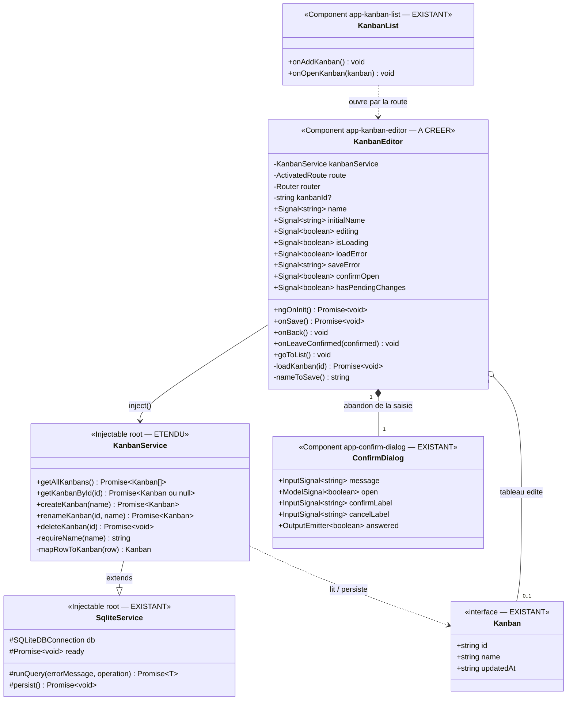

# Approche de développement — Kanban : écran d'édition d'un tableau

> **Date :** 2026-10-10 · **Statut :** brouillon — à valider
> **SPEC :** `.agent/KANBAN/EDITION/FEATURE_KANBAN_EDITION.md` (US1 → US5)
> **Maquette :** `MAQUETTE_KANBAN_EDITOR.html` — **à produire avant le plan de test** (D-E12)
> **Docs de référence :** `.agent/KANBAN/CRUD/APPROCHE_KANBAN_CRUD.md` (décisions `D-K1` → `D-K12`),
> `.agent/KANBAN/CRUD/REVUE_KANBAN_CRUD.md` (constats `C11`, `C14`),
> `.agent/DIAGRAMME_CLASSES_KANBAN.md`, `.agent/PLAN_NOTES.md` (décisions `D1`, `D3`, `D5`)
> **Code de référence :** `core/services/{sqlite-service,kanban-service,notes-service}.ts`,
> `core/components/confirm-dialog/`, `note-editor/`, `kanban-list/`, `app.routes.ts`

Ce lot est le **lot 3** annoncé par `APPROCHE_KANBAN_CRUD.md` §5 : l'écran que la liste ouvre déjà
sans qu'il existe (constat `C11`). Il ferme `US2` et `US4` du lot `CRUD`, restées incomplètes.

---

## 0. Décisions de cadrage (hypothèses de la SPEC tranchées)

| # | Sujet | Choix retenu |
|---|-------|--------------|
| D-E1 | H2 — après un enregistrement réussi | **Retour à la liste** `/kanban` dans les deux cas (création et renommage), par symétrie avec l'éditeur de notes (`D3`). À revoir quand les listes et les cartes arriveront. |
| D-E2 | H3 — nom par défaut | Champ **vide** à l'ouverture d'un tableau neuf, « Sans titre » en **placeholder**. Le repli sur « Sans titre » se fait **à l'enregistrement**, dans le composant. Le bouton d'enregistrement n'est **jamais désactivé**. |
| D-E3 | H5 — détection d'une modification en attente | **Comparaison du nom affiché au nom de départ** (vide en création, nom en base en édition), sur les valeurs **nettoyées des espaces de début et de fin**. Conséquences : retaper exactement le même nom ne compte pas comme une modification, et n'ajouter que des espaces non plus. *(Tranché le 2026-10-10.)* |
| D-E4 | US1 — identifiant inexistant dans la route | **Retour immédiat à la liste, sans message** dès que la lecture ne renvoie aucun tableau. **Écart assumé** avec l'éditeur de notes, qui affiche « Note introuvable » (`D5`) : la SPEC demande ici que l'utilisateur soit *ramené à la liste*. *(Tranché le 2026-10-10.)* |
| D-E5 | H7 — titre de l'écran | « **Nouveau tableau** » en création, « **Modifier le tableau** » en édition, dans une barre de navigation calquée sur celle de l'éditeur de notes (*Annuler · titre · Enregistrer*). |
| D-E6 | H6 — bouton « retour » matériel d'Android | **Hors périmètre** : l'avertissement d'`US4` ne couvre que le bouton de retour **de l'écran**. L'application n'intercepte pas le bouton matériel, et ce lot ne change rien à cela. |
| D-E7 | C14 — lecture unitaire | Ajout de **`getKanbanById(id): Promise<Kanban \| null>`** à `KanbanService`, sur le modèle de `getNoteById` (`null` quand aucune ligne ne correspond). C'est un **ajout de fonctionnalité écrit en TDD**, pas un refactoring. |
| D-E8 | C11 — routage et composant | Deux routes, `/kanban/new` et `/kanban/edit/:id`, déclarées **avant** `path: '**'`, servies par **un seul** composant `KanbanEditor` (`app-kanban-editor`, dossier `kanban-editor/`). La présence de `:id` fait la différence entre création et édition, comme `D1` pour les notes. |
| D-E9 | US5 — échec de l'enregistrement | L'utilisateur **reste** sur l'écran, sa saisie intacte, et un **bandeau d'erreur visible** s'affiche (pas seulement la console) — même écart volontaire avec les notes que celui déjà fait sur la liste des tableaux (`D-K7`). La modification reste « en attente » au sens d'`US4`. |
| D-E10 | Service inchangé | `createKanban` et `renameKanban` sont **réutilisés tels quels**. Leur refus d'un nom vide reste un **filet de sécurité** : grâce à D-E2, un nom vide ne leur parvient jamais. |
| D-E11 | Zone de contenu du tableau | **Bloc statique vide** annonçant les listes et les cartes à venir. Aucun comportement, aucun appel au service : c'est le point d'ancrage visuel du lot suivant. |
| D-E12 | H8 — maquette | **Oui** : `MAQUETTE_KANBAN_EDITOR.html` est produite et validée **avant** le plan de test, comme pour la liste et pour les notes. *(Tranché le 2026-10-10.)* |
| D-E13 | Tableau supprimé pendant l'édition | `renameKanban` signale « Kanban introuvable » quand aucune ligne n'a été modifiée. Ce cas est traité **comme un échec d'enregistrement** (D-E9) : message visible, saisie conservée. Pas de traitement spécifique dans ce lot. |

---

## 1. Diagramme de classes

> **Légende :** « EXISTANT » = réutilisé sans modification ; « ÉTENDU » = code existant auquel ce
> lot ajoute quelque chose ; « À CRÉER » = nouveau code. `?` = optionnel.

**Existant réutilisé sans modification :** le modèle `Kanban`, `SqliteService`, `ConfirmDialog`,
`KanbanList` (elle navigue déjà vers les deux routes), `createKanban`, `renameKanban`.
**Étendu :** `KanbanService`, d'une seule méthode — `getKanbanById` (D-E7).
**À créer :** le composant `KanbanEditor` (classe, gabarit, feuille de style), les deux routes
`/kanban/new` et `/kanban/edit/:id` dans `app.routes.ts`, et la maquette
`MAQUETTE_KANBAN_EDITOR.html`.

**Aucun changement de schéma SQLite** : la table `kanbans` porte déjà tout ce dont ce lot a besoin.
Pas de migration, donc pas de `npm run build` + `npx cap sync` imposés par un changement de base.

---

## 2. Lecture des relations

| Relation | Signification |
|---|---|
| `KanbanService` hérite de `SqliteService` | Inchangé : `getKanbanById` passe par le même `runQuery`, donc attend que la base soit prête et journalise son erreur avant de la relancer. |
| `KanbanEditor` utilise `KanbanService` | L'écran lit le tableau à éditer, puis appelle `createKanban` **ou** `renameKanban` selon le mode. Il ne touche jamais la base directement. |
| `KanbanEditor` contient `ConfirmDialog` | Même popup que les suppressions (note ou tableau), ici pour confirmer l'**abandon d'une saisie** non enregistrée (`US4`). |
| `KanbanEditor` utilise `ActivatedRoute` | Lecture de `:id` **une seule fois** à l'initialisation (`snapshot.paramMap`), comme `NoteEditor` : l'écran n'est jamais réutilisé pour un autre tableau sans être recréé. |
| `KanbanEditor` utilise `Router` | Retour à `/kanban` : après un enregistrement réussi (D-E1), après une confirmation d'abandon (`US4`), et sur identifiant inexistant (D-E4). |
| `KanbanList` ouvre `KanbanEditor` | Par la route seulement (`/kanban/new`, `/kanban/edit/:id`) : aucune dépendance de code entre les deux composants. |

---

## 3. Approche de développement

### Règle commune : le nom du tableau (US2, US3)

Le nom affiché est tel que l'utilisateur l'a tapé. **Deux traitements** s'appliquent dessus, et il
faut les garder distincts :

- **à l'enregistrement** — le nom est nettoyé de ses espaces de début et de fin (les espaces
  intérieurs sont conservés) ; s'il est vide après ce nettoyage, c'est « **Sans titre** » qui est
  enregistré (D-E2). Le service refuserait un nom vide, il n'en reçoit donc jamais (D-E10) ;
- **pour la détection d'une modification en attente** — le nom nettoyé est comparé au nom de départ
  nettoyé (D-E3).

### Lot A — Lecture unitaire : `KanbanService.getKanbanById` (US1, US3)

*Première brique, écrite en TDD avant tout code d'écran : sans elle, l'édition d'un tableau
existant ne peut rien afficher (constat `C14`).*

**Quand l'écran demande un tableau par son identifiant…**
- — je passe par le même enrobage que les autres lectures : j'attends que la base soit prête, et
  toute erreur est journalisée puis relancée vers l'appelant ;
- — je cherche la ligne de la table `kanbans` portant cet identifiant ;
- — si je la trouve, je la convertis vers le modèle `Kanban` (identifiant, nom, date de dernière
  modification) et je la renvoie ;
- — **si aucune ligne ne correspond**, je renvoie `null` : ce n'est pas une erreur, c'est une
  réponse (modèle de `getNoteById`) ;
- — si la base échoue, je relance l'erreur ; c'est l'écran qui décide quoi en montrer.

*Rappel de méthode (mémoire projet) : les tests de ce lot assertent les **données renvoyées**
— le tableau trouvé, `null`, l'erreur relancée — **jamais** la requête SQL émise.*

### Lot B — Ouverture de l'écran : chargement et modes (US1, US2)

**Quand j'arrive sur `/kanban/new`…**
- — je lis l'identifiant dans la route : il est absent, je suis donc en **mode création** ;
- — je laisse le champ de nom **vide**, avec « Sans titre » en indication (D-E2) ;
- — je note que le **nom de départ est vide** : tant que l'utilisateur n'a rien tapé, il n'y a
  aucune modification en attente ;
- — je **n'écris rien en base** et je n'appelle aucune lecture : ouvrir l'écran puis revenir en
  arrière ne laisse aucun tableau fantôme (`D-K11`) ;
- — j'affiche « Nouveau tableau » dans la barre de navigation (D-E5).

**Quand j'arrive sur `/kanban/edit/:id`…**
- — je lis l'identifiant dans la route : il est présent, je suis en **mode édition** ;
- — j'affiche un **indicateur de chargement** et je demande le tableau au service (lot A) ;
- — **si je reçois un tableau**, je remplis le champ avec son nom et je retiens ce nom comme **nom
  de départ**, puis je retire l'indicateur de chargement ;
- — **si je reçois `null`** (identifiant inexistant), je ne montre aucune erreur et je **navigue
  vers `/kanban`** (D-E4) ;
- — **si la lecture échoue**, je retire l'indicateur de chargement, j'affiche un message d'erreur
  de chargement, et je laisse un **bouton de retour** vers la liste : l'écran ne reste jamais bloqué
  sur son spinner ;
- — j'affiche « Modifier le tableau » dans la barre de navigation (D-E5).

**Dans les deux cas…**
- — la **zone de contenu du tableau** est visible et vide, avec une indication que les listes et les
  cartes viendront plus tard (D-E11).

### Lot C — Enregistrement (US2, US3, US5)

**Quand je touche le bouton « Enregistrer »…**
- — j'efface le message d'erreur de la tentative précédente : un message d'un essai passé serait lu
  comme portant sur celui-ci ;
- — je calcule le **nom à enregistrer** : le nom saisi nettoyé de ses espaces de début et de fin,
  ou « Sans titre » s'il ne reste rien (D-E2) ;
- — **en mode création**, je demande au service de créer un tableau portant ce nom ;
- — **en mode édition**, je demande au service de renommer le tableau de la route avec ce nom — ce
  qui met à jour son nom **et** sa date de dernière modification, d'où sa remontée en tête de liste ;
- — **si l'écriture réussit**, je prends le nom enregistré comme nouveau **nom de départ** — il n'y
  a donc plus de modification en attente (`US4`) — puis je navigue vers `/kanban`, où l'utilisateur
  voit la nouvelle carte ou le nom corrigé (D-E1) ;
- — **si l'écriture échoue**, je **reste** sur l'écran : le champ garde la saisie, un bandeau
  d'erreur visible annonce que l'enregistrement a échoué, et le nom de départ est **inchangé** —
  la modification reste donc « en attente » (D-E9). L'utilisateur peut retoucher le nom et
  réessayer autant de fois qu'il veut.

**Cas limites de ce lot :**
- enregistrer **sans avoir touché au nom** en mode édition : le tableau est réécrit avec le même
  nom, sa date de modification est rafraîchie, et le retour à la liste a lieu normalement — « sans
  effet néfaste » au sens d'`US3` ;
- enregistrer un nom **fait uniquement d'espaces** : c'est « Sans titre » qui part en base ;
- tableau **supprimé depuis une autre vue** pendant l'édition : le service signale « Kanban
  introuvable », traité comme n'importe quel échec (D-E13).

### Lot D — Retour à la liste et avertissement (US4)

**Quand je touche le bouton de retour alors que je n'ai rien changé…**
- — je compare le nom affiché au nom de départ (nettoyés tous les deux) : ils sont identiques,
  il n'y a **aucune modification en attente** ;
- — je navigue **immédiatement** vers `/kanban`, sans poser de question.

**Quand je touche le bouton de retour avec une saisie non enregistrée…**
- — la comparaison montre une différence : j'ouvre la **popup de confirmation** (`ConfirmDialog`,
  le même composant que les suppressions) prévenant que les modifications seront perdues ;
- — **si je réponds « Annuler »**, si je clique hors de la popup ou si j'appuie sur Échap, la popup
  se ferme, je reste sur l'écran et **ma saisie est intacte** : aucune navigation, aucune écriture ;
- — **si je confirme**, je navigue vers `/kanban` **sans rien enregistrer** : aucun tableau créé,
  aucun nom modifié.

**Points d'algorithme :**
- la détection de modification en attente est un **état dérivé**, recalculé du nom affiché et du nom
  de départ — il n'y a aucun drapeau à remettre à zéro (D-E3) ;
- le retour sur l'état d'**erreur de chargement** (lot B) est un retour **sans question** : il n'y a
  pas de saisie à perdre ;
- la popup ne sert **que** l'abandon de saisie : la suppression d'un tableau reste sur la liste.

### Lot E — Routage et ancrage visuel (US1 → US4)

**Quand l'application démarre…**
- — `app.routes.ts` déclare `/kanban/new` puis `/kanban/edit/:id`, **avant** la route « adresse
  inconnue » qui redirige vers les notes, sinon les deux adresses continueraient de tomber sur
  « Mes Notes » (constat `C11`) ;
- — les deux routes pointent vers **le même composant** `KanbanEditor` (D-E8).

**À la même occasion**, le commentaire périmé de `app.routes.ts` sur la route `/kanban` (« *la saisie
du nom se fait en popup* », constat `C12`) est corrigé : c'est précisément cet écran qui la porte.

La **zone de contenu du tableau** (D-E11) est posée dans le gabarit comme un bloc vide légendé.
Elle ne porte ni bouton ni appel au service : c'est l'emplacement où le lot suivant branchera les
listes et les cartes.

---

## 4. Impacts et points d'attention

- **Fichiers existants touchés** : `app.routes.ts` (deux routes + commentaire `C12`) et
  `core/services/kanban-service.ts` (une méthode ajoutée). Aucune modification de `KanbanList`, de
  `ConfirmDialog`, du modèle `Kanban`, ni du schéma de la base.
- **Pas de migration SQLite**, donc pas de `npm run build` + `npx cap sync` imposés par un
  changement de schéma — seulement le build habituel pour voir l'écran sur le téléphone.
- **Démonstrabilité du lot `CRUD`** : avec ces deux routes, « + » et le clic sur une carte cessent
  de retomber sur « Mes Notes » (`C11`). C'est la première fois que le parcours Kanban est
  démontrable à la main de bout en bout.
- **Écart assumé avec l'éditeur de notes** sur deux points, à ne pas « corriger » par réflexe de
  symétrie : l'identifiant inexistant ramène à la liste au lieu d'afficher « introuvable » (D-E4),
  et l'échec d'enregistrement affiche un message au lieu de rester dans la console (D-E9).
- **Nom de départ et enregistrement réussi** : remettre le nom de départ à jour **avant** de
  naviguer rend le critère « plus de modification en attente » d'`US4` observable, y compris dans un
  test où le routeur est espionné et où le composant reste donc monté. C'est le détail
  d'implémentation le plus facile à oublier.
- **Lecture de la route par `snapshot`** : l'écran ne suit pas les changements de paramètre. Passer
  de `/kanban/edit/a` à `/kanban/edit/b` sans quitter l'écran n'est pas un parcours possible
  aujourd'hui (on repasse toujours par la liste), mais ce serait un piège si une future navigation
  interne apparaissait.
- **Bouton « retour » matériel d'Android** (D-E6) : la saisie reste perdable par ce geste. C'est un
  trou connu et accepté, à reprendre quand l'application interceptera ce bouton — pour cet écran
  comme pour l'éditeur de notes, qui a le même.
- **Accessibilité** : libellés accessibles sur les deux boutons de la barre de navigation, champ de
  nom relié à son étiquette, bandeau d'erreur annoncé comme une alerte (`role="alert"`, comme sur la
  liste), et `ConfirmDialog` garde son comportement de fenêtre modale (Échap, clic hors de la popup).
- **Anti-régression** : les tests existants de `kanban-list` espionnent le routeur et ne doivent pas
  bouger ; ceux de `kanban-service` couvrent déjà la création et le renommage, `getKanbanById`
  s'ajoute à côté sans les toucher.

---

## 5. Découpage suggéré

| Ordre | Lot | Dépend de | US servies | Ce qu'il faudra tester (→ `plan_test`) |
|---|---|---|---|---|
| A | `KanbanService.getKanbanById` | — | US1, US3 | tableau trouvé (données renvoyées), identifiant inexistant → `null`, erreur de base relancée |
| B | `KanbanEditor` — ouverture et chargement | A | US1, US2 | mode création (champ vide, placeholder, aucune écriture), mode édition (champ pré-rempli), indicateur de chargement, identifiant inexistant → retour à la liste, erreur de chargement → message + retour, titre de l'écran |
| C | `KanbanEditor` — enregistrement | B | US2, US3, US5 | création avec le nom saisi, renommage + date de modification, nettoyage des espaces, repli « Sans titre », retour à la liste après succès, échec → maintien de l'écran + saisie intacte + message visible |
| D | `KanbanEditor` — retour et confirmation | C | US4 | retour immédiat sans modification, popup avec modification en attente, annulation / clic hors popup / Échap sans navigation ni écriture, confirmation → retour sans écriture, plus de modification en attente après un succès |
| E | Routes + zone de contenu vide | B | US1 → US4 | les deux routes servent l'écran, déclarées avant `**` ; la zone de contenu est présente et vide |

**Étape immédiate avant le plan de test (D-E12)** : produire `MAQUETTE_KANBAN_EDITOR.html` —
barre de navigation (*Annuler · titre · Enregistrer*), champ de nom, zone de contenu vide, bandeau
d'erreur et popup de confirmation, avec les tokens visuels de `note-list.css` et de
`MAQUETTE_KANBAN_LIST.html`. Elle fixera le **contrat DOM** que le plan de test reprendra.

**Hors périmètre de ce lot** (rappel de la SPEC) : création de listes (colonnes) et de cartes,
glisser-déposer, suppression d'un tableau depuis cet écran, enregistrement automatique, description /
couleur / catégorie d'un tableau, unicité du nom, annuler / rétablir sur le nom, interception du
bouton « retour » matériel, partage et synchronisation.
