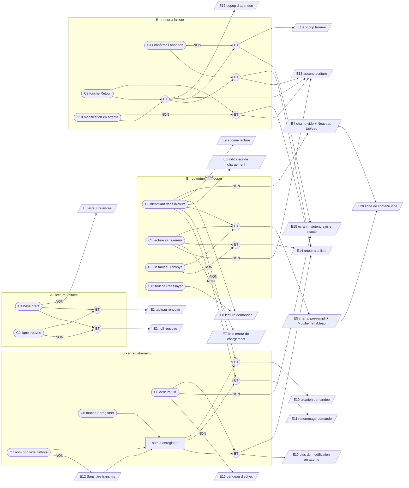

# Plan de test (TDD) — Kanban : écran d'édition d'un tableau

## 1. Introduction

> **Date :** 2026-10-10 · **Statut :** brouillon — à valider
> **SPEC :** [`FEATURE_KANBAN_EDITION.md`](FEATURE_KANBAN_EDITION.md) (US1 → US5) · **Approche :**
> [`APPROCHE_KANBAN_EDITION.md`](APPROCHE_KANBAN_EDITION.md) (décisions `D-E1` → `D-E13`) ·
> **Maquette :** [`MAQUETTE_KANBAN_EDITOR.html`](MAQUETTE_KANBAN_EDITOR.html) (écrans 1 à 6)
> **Jumeaux :** `note-editor/note-editor.spec.ts` (écran d'édition),
> `kanban-list/kanban-list.spec.ts` (page du même lot),
> `core/services/kanban-service.spec.ts` (service)

Approche **boîte noire / TDD** : ce plan décrit le comportement attendu **avant** toute
implémentation. Il couvre deux objets, testés chacun dans son propre `.spec.ts` :

- **A — `KanbanService.getKanbanById`** : lecture unitaire d'un tableau, absente à ce jour
  (constat `C14` de `REVUE_KANBAN_CRUD.md`), plugin SQLite simulé ;
- **B — écran `KanbanEditor`** (routes `/kanban/new` et `/kanban/edit/:id`) : saisie et
  enregistrement du nom du tableau, états chargement / erreur, avertissement avant d'abandonner une
  saisie ; source de données simulée, navigation espionnée, `ConfirmDialog` réel piloté par le DOM.

Ce lot ferme `US2` et `US4` du lot `CRUD`, restées incomplètes faute d'écran d'édition
(constat `C11`).

**Hors périmètre de ce plan :**

- **les deux routes de `app.routes.ts`** (`/kanban/new`, `/kanban/edit/:id`, déclarées avant
  `path: '**'`) : lot E de l'approche, **vérifié à la main** en lançant l'application — le projet
  n'a aujourd'hui aucun spec de routage, et en introduire un dépasse ce lot *(tranché le
  2026-10-10)* ;
- listes (colonnes) et cartes du tableau, glisser-déposer : la zone de contenu est seulement
  vérifiée **présente et vide** (`D-E11`) ;
- suppression d'un tableau depuis cet écran (elle reste sur la liste, `US5` du lot `CRUD`) ;
- enregistrement automatique, description / couleur / catégorie d'un tableau, unicité du nom,
  annuler / rétablir sur le nom ;
- **bouton « retour » matériel d'Android** (`D-E6`) : l'application ne l'intercepte pas, et
  l'avertissement d'`US4` ne couvre que le bouton de retour de l'écran ;
- `createKanban`, `renameKanban` et `getAllKanbans`, déjà couverts par
  `PLAN_TESTS_KANBAN_CRUD.md` partie A — ce plan n'y touche pas (`D-E10`).

Les cas de test (§5) sont **dérivés du graphe cause-effet et de sa table de décision** (§3) : chaque
colonne `R#` produit au moins un cas `T#`, et chaque cas cite la ou les colonnes qu'il couvre.

---

## 2. Objet testé

| Objet | Rôle fonctionnel |
|---|---|
| `KanbanService.getKanbanById(id)` | Rendre un tableau depuis la base à partir de son identifiant, ou `null` quand aucun ne correspond — sur le modèle de `getNoteById` (`D-E7`). |
| `KanbanEditor` (`app-kanban-editor`) | Écran unique des deux routes (`D-E8`) : il affiche et modifie le **nom** du tableau, l'enregistre (création ou renommage), ramène à la liste, et avertit avant de perdre une saisie non enregistrée. |

**Périmètre validé** : nom du tableau uniquement. L'écran portera plus tard les listes et les
cartes ; ce lot pose seulement leur emplacement.

---

## 3. Graphe cause-effet et table de décision

### Causes

**Partie A — `getKanbanById`**

| # | Cause (condition d'entrée) |
|---|---|
| C1 | La base est prête (préparation de la table réussie) |
| C2 | Une ligne de `kanbans` porte l'identifiant demandé |

**Partie B — `KanbanEditor`**

| # | Cause (condition d'entrée) |
|---|---|
| C3 | La route porte un identifiant → **mode édition** (absent → mode création) |
| C4 | La lecture du tableau aboutit sans erreur |
| C5 | La lecture renvoie un tableau, plutôt que `null` |
| C6 | L'utilisateur touche « Enregistrer » |
| C7 | Le nom saisi est non vide après retrait des espaces de début / fin |
| C8 | L'écriture demandée (création ou renommage) réussit |
| C9 | L'utilisateur touche le bouton de retour |
| C10 | Le nom affiché diffère du nom de départ, tous deux nettoyés → **modification en attente** (`D-E3`) |
| C11 | L'utilisateur confirme l'abandon, plutôt que d'annuler (bouton, clic hors popup, Échap) |
| C12 | L'utilisateur touche « Réessayer » depuis l'erreur de chargement |

### Effets

| # | Effet (résultat observable) |
|---|---|
| E1 | Le tableau est renvoyé converti au modèle : identifiant, nom, date de dernière modification |
| E2 | `null` est renvoyé — une réponse, pas une erreur |
| E3 | L'erreur de base est relancée vers l'appelant |
| E4 | Champ de nom **vide**, « Sans titre » en indication, titre « Nouveau tableau » |
| E5 | Champ de nom **pré-rempli** avec le nom du tableau, titre « Modifier le tableau » |
| E6 | L'indicateur de chargement est affiché |
| E7 | Le bloc d'erreur de chargement est affiché (message + « Réessayer » + « Revenir à la liste »), **sans** champ de nom ni « Enregistrer » |
| E8 | La lecture du tableau est demandée, sur l'identifiant de la route |
| E9 | **Aucune lecture** n'est demandée |
| E10 | La **création** est demandée avec le nom à enregistrer |
| E11 | Le **renommage** est demandé sur l'identifiant de la route, avec le nom à enregistrer |
| E12 | Le nom transmis au service est « **Sans titre** » |
| E13 | **Aucune écriture** : ni création ni renommage demandés |
| E14 | Retour à la liste `/kanban` |
| E15 | L'écran reste affiché, la saisie intacte — aucune navigation |
| E16 | Le bandeau « Impossible d'enregistrer le tableau. » est affiché |
| E17 | La popup d'abandon est ouverte, prévenant que les modifications seront perdues |
| E18 | La popup est fermée |
| E19 | Plus de modification en attente : le retour ne pose plus de question |
| E20 | La zone de contenu du tableau est présente et vide, sans aucun appel au service |

### Graphe

**Contraintes entre causes :**

- **E (exclusion)** — C6, C9, C12 : une seule action utilisateur à la fois.
- **R (requiert)** — C5 requiert C4 ; C10 et C11 n'ont de sens qu'avec C9 ; C12 n'a de sens
  qu'avec NON C4 ; C8 n'a de sens qu'avec C6 ; C2 ne concerne que la partie A.
- **M (masque)** — NON C3 (mode création) masque C4, C5 et C12 : rien n'est lu, donc E9. NON C1
  masque C2 : sans base prête, la lecture est rejetée avant d'atteindre la table.

> **Piège du graphe, à ne pas câbler de travers.** NON C7 ne produit **pas** E13 : grâce à `D-E2`
> l'écriture a bien lieu, avec « Sans titre » (E12). Un nom vide n'est jamais *refusé* par l'écran ;
> il est *remplacé*. Le refus d'un nom vide reste au service, en filet de sécurité qui n'est jamais
> atteint depuis cet écran (`D-E10`).

### Table de décision

Légende : `V` vraie · `F` fausse · `–` indifférente / sans objet · `X` effet attendu · vide = effet absent.
Les colonnes `R1`–`R3` décrivent le **service seul** ; `R4`–`R18` décrivent l'**écran**, pour
lequel C1 est toujours vraie.

| | R1 | R2 | R3 | R4 | R5 | R6 | R7 | R8 | R9 | R10 | R11 | R12 | R13 | R14 | R15 | R16 | R17 | R18 |
|---|---|---|---|---|---|---|---|---|---|---|---|---|---|---|---|---|---|---|
| **C1** base prête | F | V | V | – | – | – | – | – | – | – | – | – | – | – | – | – | – | – |
| **C2** ligne trouvée | – | V | F | – | – | – | – | – | – | – | – | – | – | – | – | – | – | – |
| **C3** id dans la route | – | – | – | F | V | V | V | V | V | F | F | V | V | – | – | – | – | – |
| **C4** lecture sans erreur | – | – | – | – | V | V | F | F | F | – | – | – | – | – | – | – | – | – |
| **C5** tableau renvoyé | – | – | – | – | V | F | – | – | – | – | – | – | – | – | – | – | – | – |
| **C6** touche Enregistrer | – | – | – | F | F | F | F | F | F | V | V | V | V | V | F | F | F | F |
| **C7** nom non vide | – | – | – | – | – | – | – | – | – | V | F | V | F | – | – | – | – | – |
| **C8** écriture OK | – | – | – | – | – | – | – | – | – | V | V | V | V | F | – | – | – | – |
| **C9** touche Retour | – | – | – | F | F | F | F | F | V | F | F | F | F | F | V | V | V | V |
| **C10** modif. en attente | – | – | – | – | – | – | – | – | F | – | – | – | – | – | F | V | V | V |
| **C11** confirme l'abandon | – | – | – | – | – | – | – | – | – | – | – | – | – | – | – | – | F | V |
| **C12** touche Réessayer | – | – | – | – | – | – | F | V | F | – | – | – | – | – | – | – | – | – |
| E1 tableau renvoyé | | X | | | | | | | | | | | | | | | | |
| E2 `null` renvoyé | | | X | | | | | | | | | | | | | | | |
| E3 erreur relancée | X | | | | | | | | | | | | | | | | | |
| E4 champ vide + titre création | | | | X | | | | | | | | | | | | | | |
| E5 champ pré-rempli + titre édition | | | | | X | | | X | | | | | | | | | | |
| E6 indicateur de chargement | | | | | X | X | X | X | | | | | | | | | | |
| E7 bloc erreur de chargement | | | | | | | X | | | | | | | | | | | |
| E8 lecture demandée | | | | | X | X | X | X | | | | | | | | | | |
| E9 aucune lecture | | | | X | | | | | | | | | | | | | | |
| E10 création demandée | | | | | | | | | | X | X | | | | | | | |
| E11 renommage demandé | | | | | | | | | | | | X | X | | | | | |
| E12 « Sans titre » transmis | | | | | | | | | | | X | | X | | | | | |
| E13 aucune écriture | | | | X | X | X | X | X | X | | | | | | X | X | X | X |
| E14 retour à la liste | | | | | | X | | | X | X | X | X | X | | X | | | X |
| E15 écran maintenu, saisie intacte | | | | | | | | | | | | | | X | | X | X | |
| E16 bandeau d'échec | | | | | | | | | | | | | | X | | | | |
| E17 popup d'abandon | | | | | | | | | | | | | | | | X | | |
| E18 popup fermée | | | | | | | | | | | | | | | | | X | |
| E19 plus de modif. en attente | | | | | | | | | | X | X | X | X | | | | | |
| E20 zone de contenu vide | | | | X | X | | | | | | | | | | | | | |
| **Cas dérivés** | T1.3 | T1.1 | T1.2 | T2.1–T2.5 T10.1 | T3.1–T3.5 T10.2 | T4.1 | T4.2 T4.5 | T4.4 | T4.3 | T5.1 T5.4 T5.5 | T5.2 T5.3 | T6.1 T6.2 T6.4 T6.5 T9.6 | T6.3 | T7.1–T7.6 T9.7 | T8.1–T8.5 | T9.1 T9.8 | T9.2 T9.3 T9.4 | T9.5 |

> **La colonne R8 décrit une transition**, pas un état stable : `C4` y est fausse parce que c'est
> l'échec de la lecture qui a amené l'utilisateur sur le bloc d'erreur, et `C12` est vraie parce
> qu'il touche « Réessayer ». Les effets listés sont ceux de la **seconde** lecture, celle qui
> aboutit. T4.4 couvre la transition entière, d'où sa notation `R7 → R8`.
>
> **E6 en colonne R4** est volontairement vide, et c'est une exigence à part entière : un tableau
> neuf n'attend rien de la base, donc **aucun** indicateur de chargement ne doit apparaître
> (T2.3).
>
> **E14 en colonne R14** est vide de la même façon : un enregistrement en échec ne doit surtout pas
> ramener à la liste (T7.1).
>
> **E19 en colonne R14** est vide aussi : après un échec, la modification reste « en attente », donc
> le retour continue de demander confirmation (T9.7).
>
> **E18 en colonne R18** n'est pas asserté : la popup se ferme et l'écran est quitté dans le même
> geste ; seule la navigation est observable, et `ConfirmDialog` se referme déjà tout seul.

---

## 4. Décisions de conception à figer

Ces décisions complètent `D-E1` → `D-E13` de l'approche et portent sur ce que les tests assertent.
Elles sont **à confirmer** avant `ecrire_tests`.

- **D1 — Contrat DOM issu de la maquette** *(à confirmer)* : les sélecteurs de §7 sont ceux de
  `MAQUETTE_KANBAN_EDITOR.html`. Le gabarit du composant devra les honorer, à la différence de
  `kanban-list`, dont le spec avait suivi le gabarit faute de contrat figé.
- **D2 — Libellés et messages exacts** *(à confirmer)*, tels que la maquette les porte :
  titre « Nouveau tableau » / « Modifier le tableau » ; indication du champ « Sans titre » ;
  erreur de chargement « Impossible de charger ce tableau. » ; bandeau d'échec d'enregistrement
  « Impossible d'enregistrer le tableau. » ; popup d'abandon « Vos modifications ne seront pas
  enregistrées. Quitter ce tableau ? », avec « Quitter » comme libellé de confirmation et
  « Annuler » comme libellé d'annulation.
- **D3 — Erreur de chargement : deux boutons** *(tranché le 2026-10-10)* : « **Réessayer** », qui
  relance la lecture du tableau, **et** « **Revenir à la liste** », qui ramène à `/kanban`. Par
  symétrie avec l'état d'erreur de la liste des tableaux (T7.3 du lot `CRUD`). **L'écran 6 de la
  maquette est à mettre à jour** : il ne porte aujourd'hui qu'un seul bouton et la question « à
  trancher » qui vient d'être tranchée ici.
- **D4 — « Réessayer » relance la seule lecture** *(à confirmer)* : même chemin que le chargement
  initial (`getKanbanById` sur l'identifiant de la route), sans rechargement de l'écran ni de la
  page. Un `null` au second essai se comporte comme au premier : retour à la liste (`D-E4`).
- **D5 — Nom de départ rafraîchi avant la navigation** *(à confirmer)* : après une écriture
  réussie, le nom enregistré devient le nom de départ **avant** l'appel au routeur. C'est ce qui
  rend E19 observable dans un test où le routeur est espionné et où le composant reste donc monté
  (§4 de l'approche : le détail le plus facile à oublier). T9.6 l'asserte.
- **D6 — Le bouton de retour de la barre de navigation porte la classe `.btn-back`**
  *(à confirmer)* : **pas** `.btn-cancel`, qui est déjà celle du bouton d'annulation de
  `ConfirmDialog`. Sans cette séparation, les tests du groupe 9 ne pourraient pas distinguer les
  deux boutons. Écart volontaire avec `note-editor.html`, dont la barre utilise `.btn-cancel`.
- **D7 — Deux fichiers de spec** *(à confirmer)* : `core/services/kanban-service.spec.ts`
  (partie A, **complété** sans toucher aux cas existants) et
  `kanban-editor/kanban-editor.spec.ts` (partie B, nouveau).
- **D8 — L'identifiant de la route est lu une seule fois** *(à confirmer)* : les tests fournissent
  `snapshot.paramMap` et ne simulent **aucun** changement de paramètre en cours de vie de l'écran
  (§4 de l'approche : ce parcours n'existe pas aujourd'hui).
- **D9 — La zone de contenu est vérifiée structurellement** *(à confirmer)* : présence du bloc et
  absence de toute carte ou colonne, plus l'absence d'appel au service imputable à cette zone. Son
  libellé exact n'est pas asserté — il changera au lot suivant.

---

## 5. Cas de test

Chaque cas décrit **un** comportement observable ; entre parenthèses : user story et colonne(s)
`R#` de la table de décision.

### Partie A — `KanbanService`

#### Groupe 1 — Lecture unitaire d'un tableau (`getKanbanById`)

- **T1.1** Le tableau portant l'identifiant demandé est renvoyé, converti au modèle : identifiant,
  nom et date de dernière modification ; la date de création n'est pas exposée. *(US1, US3 · R2)*
- **T1.2** Quand aucun tableau ne porte cet identifiant, `null` est renvoyé — ce n'est pas une
  erreur. *(US1 · R3)*
- **T1.3** Quand la base échoue ou n'a pas pu être préparée, l'erreur est relancée vers l'appelant.
  *(US1 · R1)*

> *Rappel de méthode (mémoire projet) : ces trois cas assertent les **données renvoyées** — le
> tableau trouvé, `null`, l'erreur relancée — **jamais** la requête SQL émise.*

### Partie B — écran `KanbanEditor`

#### Groupe 2 — Ouverture d'un tableau neuf (`/kanban/new`)

- **T2.1** Le champ de nom est vide et porte « Sans titre » en simple indication. *(US2 · R4)*
- **T2.2** Aucune lecture n'est demandée à la source de données : il n'y a rien à charger.
  *(US2 · R4)*
- **T2.3** Aucun indicateur de chargement n'est affiché : un tableau neuf n'attend rien de la base.
  *(US2 · R4)*
- **T2.4** Le titre de l'écran est « Nouveau tableau ». *(US2 · R4)*
- **T2.5** Ouvrir l'écran n'écrit **rien** : ni création ni renommage demandés — en repartir ne
  laisse aucun tableau fantôme dans la liste. *(US2 · R4)*

#### Groupe 3 — Ouverture d'un tableau existant (`/kanban/edit/:id`)

- **T3.1** Le tableau de la route est demandé **une seule fois**, sur son identifiant. *(US1 · R5)*
- **T3.2** Le champ de nom est pré-rempli avec le nom du tableau. *(US1, US3 · R5)*
- **T3.3** Le titre de l'écran est « Modifier le tableau ». *(US1 · R5)*
- **T3.4** Un indicateur de chargement est affiché tant que la source n'a pas répondu ; il
  disparaît une fois le tableau affiché. *(US1 · R5)*
- **T3.5** Ouvrir l'écran n'écrit rien. *(US1 · R5)*

#### Groupe 4 — Identifiant inexistant et erreur de chargement

- **T4.1** Un identifiant ne correspondant à aucun tableau ramène à la liste, **sans** message
  d'erreur ni popup de confirmation. *(US1 · R6)*
- **T4.2** Si la lecture échoue, « Impossible de charger ce tableau. » est affiché, l'indicateur de
  chargement est retiré, et **ni** champ de nom **ni** bouton « Enregistrer » ne sont affichés :
  l'écran ne reste jamais bloqué sur son indicateur. *(US1 · R7)*
- **T4.3** « Revenir à la liste » depuis l'erreur de chargement ramène à la liste, **sans** popup
  de confirmation : il n'y a aucune saisie à perdre. *(US1 · R9)*
- **T4.4** « Réessayer » relance la lecture du tableau ; la source rétablie, le champ se remplit
  avec le nom et le message d'erreur disparaît. *(US1 · R7 → R8)*
- **T4.5** Aucune écriture n'est demandée depuis l'état d'erreur de chargement. *(US1 · R7)*

#### Groupe 5 — Enregistrement d'un tableau neuf

- **T5.1** La création est demandée avec le nom saisi **sans ses espaces de début et de fin** ; les
  espaces intérieurs sont conservés. *(US2 · R10)*
- **T5.2** Champ laissé vide : le tableau est créé sous le nom « **Sans titre** ». *(US2 · R11)*
- **T5.3** Nom composé uniquement d'espaces : même repli sur « Sans titre » — un nom vide ne part
  jamais en base. *(US2 · R11)*
- **T5.4** Aucun renommage n'est demandé en mode création. *(US2 · R10)*
- **T5.5** Après une création réussie, l'utilisateur est ramené à la liste. *(US2 · R10)*

#### Groupe 6 — Enregistrement d'un tableau existant

- **T6.1** Le renommage est demandé sur l'**identifiant de la route**, avec le nom nettoyé.
  *(US3 · R12)*
- **T6.2** Aucune création n'est demandée en mode édition. *(US3 · R12)*
- **T6.3** Champ vidé par l'utilisateur : le tableau est renommé « Sans titre ». *(US3 · R13)*
- **T6.4** Enregistrer **sans avoir touché au nom** demande quand même le renommage, avec le nom
  inchangé : le tableau garde son nom et sa date de modification est rafraîchie — « sans effet
  néfaste » au sens d'`US3`. *(US3 · R12)*
- **T6.5** Après un renommage réussi, l'utilisateur est ramené à la liste. *(US3 · R12)*

#### Groupe 7 — Échec de l'enregistrement

- **T7.1** L'écran **reste** affiché : aucune navigation vers la liste. *(US5 · R14)*
- **T7.2** Le nom saisi est toujours présent dans le champ : la frappe n'est pas perdue.
  *(US5 · R14)*
- **T7.3** Le bandeau « Impossible d'enregistrer le tableau. » est affiché et annoncé comme une
  alerte — le message n'est pas laissé dans la seule console. *(US5 · R14)*
- **T7.4** Une nouvelle tentative d'enregistrement efface d'abord le bandeau de la précédente :
  un message d'un essai passé ne doit pas être lu comme portant sur celui-ci.
  *(US5 · R14 → R10/R12)*
- **T7.5** Retoucher le nom puis réussir l'enregistrement ramène à la liste, bandeau disparu.
  *(US5 · R14 → R12)*
- **T7.6** Un tableau supprimé depuis une autre vue pendant l'édition — le service signalant
  « Kanban introuvable » — est traité comme n'importe quel échec : écran maintenu, saisie intacte,
  bandeau affiché. *(US5 · R14)*

#### Groupe 8 — Retour sans modification en attente

- **T8.1** Mode création, champ resté vide : le retour ramène **immédiatement** à la liste, sans
  aucune popup. *(US4 · R15)*
- **T8.2** Mode édition, nom inchangé : le retour ramène immédiatement à la liste, sans popup.
  *(US4 · R15)*
- **T8.3** Retaper **exactement** le nom de départ ne compte pas comme une modification : le retour
  reste immédiat. *(US4 · R15)*
- **T8.4** N'ajouter que des espaces en début ou en fin du nom ne compte pas comme une modification :
  la comparaison porte sur les valeurs nettoyées (`D-E3`). *(US4 · R15)*
- **T8.5** Ces retours n'écrivent rien : ni création ni renommage demandés. *(US4 · R15)*

#### Groupe 9 — Retour avec modification en attente

- **T9.1** Nom modifié depuis l'ouverture : le retour ouvre la popup prévenant que les
  modifications seront perdues ; tant que l'utilisateur n'a pas répondu, aucune navigation et
  aucune écriture n'ont lieu. *(US4 · R16)*
- **T9.2** « Annuler » ferme la popup et laisse l'utilisateur sur l'écran, sa saisie intacte, sans
  navigation ni écriture. *(US4 · R17)*
- **T9.3** Un clic hors de la popup produit le même effet qu'« Annuler ». *(US4 · R17)*
- **T9.4** La touche Échap produit le même effet qu'« Annuler ». *(US4 · R17)*
- **T9.5** « Quitter » ramène à la liste **sans rien enregistrer** : aucun tableau créé, aucun nom
  modifié. *(US4 · R18)*
- **T9.6** Après un enregistrement réussi, il n'y a plus de modification en attente : le retour ne
  pose plus de question. *(US4 · R12 → R15)*
- **T9.7** Après un **échec** d'enregistrement, la modification reste en attente : le retour demande
  toujours confirmation. *(US4, US5 · R14 → R16)*
- **T9.8** Mode création : taper un nom suffit à créer une modification en attente, le nom de départ
  étant vide. *(US4 · R16)*

#### Groupe 10 — Zone de contenu du tableau

- **T10.1** En mode création, la zone de contenu du tableau est présente et vide, avec son
  indication que les listes et les cartes viendront plus tard. *(US1 · R4)*
- **T10.2** En mode édition, la zone de contenu du tableau est présente et vide de la même façon,
  et n'entraîne aucun appel supplémentaire à la source de données. *(US1 · R5)*

---

## 6. Dépendances (abstraites) et doublures

| Dépendance | Doublure retenue |
|---|---|
| **Source de données des tableaux** (partie B) | `KanbanService` **doublé** : lecture unitaire, création et renommage. `getAllKanbans` et `deleteKanban` ne sont pas appelés par cet écran ; la doublure les expose quand même, pour qu'un appel parasite se voie. |
| **Base de données** (partie A) | Même montage que `kanban-service.spec.ts` : le `DatabaseService` est doublé et la connexion simulée, avec un cas « base non préparée » pour T1.3. |
| **Navigation** | Routeur réel fourni au banc de test, sa navigation **espionnée** — exactement le montage de `kanban-list.spec.ts`, dont les tests existants ne doivent pas bouger. Les assertions portent sur la **cible** demandée (`/kanban`), pas sur un changement d'URL réel. |
| **Identifiant de la route** | Fourni par un `ActivatedRoute` doublé, dont l'instantané rend l'identifiant en mode édition et **rien** en mode création. Lu une seule fois (`D8`). |
| **Confirmation d'abandon** | `ConfirmDialog` **réel**, piloté par le DOM (aucune doublure) : c'est la seule façon de couvrir le clic hors popup (T9.3) et Échap (T9.4), qui sont son comportement propre. |
| **Horloge** | Non doublée : les dates de modification viennent du service, et ce plan ne les asserte que par le fait que le renommage est demandé (T6.4) — jamais par leur valeur. |

**Aucune de ces dépendances ne fige de signature précise ici** : les noms exacts des méthodes et
des entrées de composant sont ceux du diagramme de classes de l'approche, et c'est `ecrire_tests`
qui les traduira en code.

---

## 7. Contrat DOM

Sélecteurs ciblés par les tests, repris de `MAQUETTE_KANBAN_EDITOR.html` (`D1`). Le gabarit du
composant devra les honorer.

| Sélecteur | Rôle | Cas concernés |
|---|---|---|
| `.kanban-editor` | Racine de l'écran | — |
| `.editor-navbar` | Barre de navigation (*Retour · titre · Enregistrer*) | T4.2 |
| `.editor-navbar-title` | Titre de l'écran | T2.4, T3.3 |
| `.btn-back` | Bouton de retour de la barre de navigation, avec libellé accessible (`D6`) | T8.x, T9.x |
| `.btn-save` | Bouton « Enregistrer », jamais désactivé (`D-E2`) | T5.x, T6.x, T7.x |
| `.editor-name` | Champ de saisie du nom (`input[type="text"]`, `placeholder="Sans titre"`), relié à son étiquette | T2.1, T3.2, T4.2, T5.x, T6.x, T7.2, T8.x, T9.x |
| `.loading-overlay` / `.spinner` | Indicateur de chargement | T2.3, T3.4, T4.2 |
| `.error-state` | Bloc d'erreur de chargement | T4.2, T4.4 |
| `.btn-retry` | « Réessayer » dans le bloc d'erreur (`D3`) | T4.4 |
| `.btn-back-to-list` | « Revenir à la liste » dans le bloc d'erreur (`D3`) | T4.3 |
| `.action-error` avec `role="alert"` | Bandeau d'échec d'enregistrement | T7.3, T7.4, T7.5 |
| `.board-canvas` | Zone de contenu du tableau | T10.1, T10.2 |
| `.ghost-column` | Bloc vide légendé, annonçant les listes à venir | T10.1, T10.2 |
| `app-confirm-dialog` | Popup d'abandon (composant existant, inchangé) | T9.x |
| `.confirm-backdrop` | Fond de la popup — cible du clic hors popup | T9.3 |
| `.confirm-message` | Message de la popup | T9.1 |
| `.confirm-card .btn-confirm` | « Quitter » | T9.5 |
| `.confirm-card .btn-cancel` | « Annuler » | T9.2 |

> Les deux boutons de `ConfirmDialog` sont ciblés **depuis la carte de la popup**, et non à la
> racine du composant : c'est ce qui garantit qu'aucune confusion n'est possible avec la barre de
> navigation, dont le bouton de retour porte `.btn-back` (`D6`).

---

## 8. Ordre d'implémentation TDD suggéré

| Étape | Groupes | Pourquoi dans cet ordre |
|---|---|---|
| 1 | **Groupe 1** | Première brique : sans lecture unitaire, l'édition d'un tableau existant ne peut rien afficher (`C14`). Rouge → vert sur le service seul, avant tout code d'écran. |
| 2 | **Groupes 2 et 3**, puis **10** | Pose la classe, le gabarit et les deux modes. Le groupe 10 devient presque gratuit une fois le gabarit en place, et verrouille tout de suite l'ancrage visuel du lot suivant. |
| 3 | **Groupe 4** | Les sorties de secours de l'ouverture : identifiant inexistant, erreur de chargement, « Réessayer » et « Revenir à la liste ». À faire avant l'enregistrement, pour que l'écran ne puisse jamais rester bloqué sur son indicateur. |
| 4 | **Groupes 5 et 6**, puis **7** | Les deux chemins d'écriture d'abord au vert, puis leur échec : le groupe 7 n'a de sens qu'une fois le succès en place. |
| 5 | **Groupes 8 et 9** | L'avertissement dépend du nom de départ, que le groupe 5/6 vient de rendre observable. T9.6 et T9.7 ferment la boucle avec l'enregistrement (`D5`). |
| 6 | *Hors plan* — routes de `app.routes.ts` | Lot E de l'approche, **vérifié à la main** en lançant l'application : avec les deux routes, « + » et le clic sur une carte cessent de retomber sur « Mes Notes » (`C11`). Corriger au passage le commentaire périmé de la route `/kanban` (`C12`). |

**Anti-régression attendue** : les tests de `kanban-list` espionnent le routeur et ne doivent pas
bouger ; ceux de `kanban-service` couvrent déjà la création, le renommage et la suppression, et le
groupe 1 s'ajoute à côté sans les toucher.
