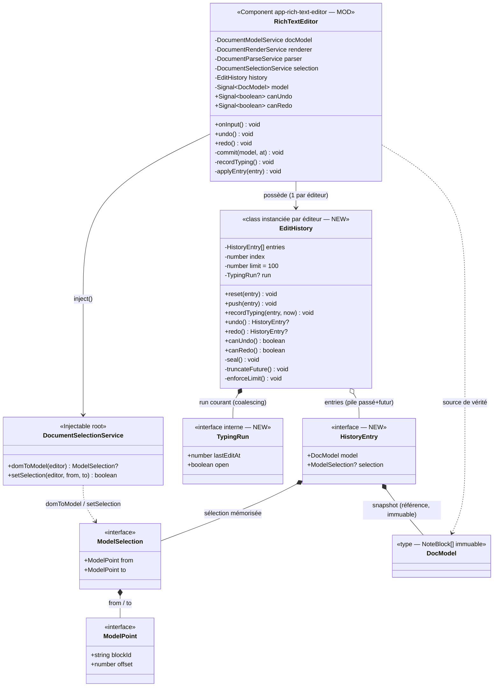

# Approche de développement — Annuler / Rétablir (Undo / Redo) dans l'éditeur de notes

**Date :** 2026-09-20
**Statut :** validé le 2026-09-20 *(choix de conception C1–C5 arbitrés par l'utilisateur)*
**SPEC de référence :** [`UNDO_REDO/FEATURE_UNDO_REDO.md`](FEATURE_UNDO_REDO.md) (validée le 2026-09-20, décisions D1–D8)
**Docs complétés :** [`DIAGRAMME_CLASSES_NOTES.md`](../DIAGRAMME_CLASSES_NOTES.md) (§5–8, modèle document + note-editor),
modèle de livrable [`URL_LINK/APPROCHE_INSERTION_LIEN.md`](../URL_LINK/APPROCHE_INSERTION_LIEN.md)

> **But de ce document :** décrire **comment** réaliser l'historique undo/redo décrit par la SPEC
> (diagramme + algorithmes), sans écrire ni test ni code final. Il précède [`plan_test`](../skill/plan_test/SKILL.md).

---

## 0. Décisions de cadrage (validées le 2026-09-20)

Cinq choix de conception, arbitrés par l'utilisateur. Ils sont **figés** et structurent le reste du
document (algorithmes du §3, diagramme du §1).

### C1 — Où vit l'historique → **classe dédiée `EditHistory`**
Classe **pure** `core/services/edit-history.ts`, **une instance par éditeur** (instanciée par
`RichTextEditor`, **pas** `providedIn:'root'` → historique propre à la note, sert D5/D7). Logique
`push/undo/redo/coalesce/bornage` **testable en isolation** sans DOM, dans l'esprit des services
`document-*`.

### C2 — Contenu d'un pas → **snapshot complet (référence immuable)**
Un pas mémorise le **`DocModel` entier** + la sélection. Le `DocModel` étant **immuable** (les commandes
`document-model` retournent toujours de nouveaux objets), le « snapshot » = **la référence** du tableau
déjà commité, **sans deep-copy** (partage structurel). Pas de diff/patch. Combiné au bornage ~100 pas
(D6), l'empreinte mémoire reste faible.

### C3 — Coalescing de la saisie libre (D1) → **pause de 500 ms + frontière de mot**
Un pas de frappe est **scellé** sur l'un des deux déclencheurs :
- **(i) frontière de mot** : le caractère saisi est un **espace** (` `, tab) ou une **ponctuation**
  (`.,;:!?…()[]{}«»"'` et saut assimilé) → scelle le pas courant ;
- **(ii) pause de frappe** : **500 ms** d'inactivité — valeur **figée** dans une **constante nommée**
  `TYPING_COALESCE_PAUSE_MS = 500` (`edit-history.ts`), **pas** une fourchette.

### C4 — (Re)chargement réel vs echo `blocksChange` (D7) → **garde par identité de référence**
Réinitialiser l'historique **uniquement** sur un vrai (re)chargement : dans l'`effect` de synchro,
si `incoming === model()` (même tableau que celui qu'on vient d'émettre) → **echo**, on ne réinitialise
pas ; sinon → **(re)chargement externe** (`note.blocks`), on **réamorce** l'historique. Robuste et local
(`commit` fait `model.set(newModel)` puis `emit(newModel)` : la référence revient identique). **Point
d'intégration critique** → couvert par un **test d'intégration dédié** (voir §4 R1).

### C5 — État « inactif » des deux boutons (D8) → **`[disabled]` natif**
`[disabled]="!canUndo()"` / `[disabled]="!canRedo()"` : grise **et** neutralise le clic (sert US2/US4),
distinct du highlight `.active` des bascules. Réutiliser `(mousedown)="$event.preventDefault()"` comme
les autres boutons (ne pas voler le focus → la **restauration de sélection** atterrit dans l'éditeur
encore focus). Placement : **groupe dédié** en tête de barre (H2), icônes ↶ / ↷ — détail maquette (D8).

---

## 1. Diagramme de classes

> Périmètre restreint au **delta** de la fonctionnalité, calqué sur le §5 de
> `DIAGRAMME_CLASSES_NOTES.md`. Membres **à créer** marqués `» NEW`, **à modifier** `» MOD` ; le reste
> existe déjà. Légende sous le diagramme. *(Conception sous les décisions figées C1–C5, §0.)*



**Légende du delta**

| Élément | Statut | Rôle |
|---|---|---|
| `EditHistory` | **NEW** | Pile passé/futur + coalescing + bornage ; logique pure testable seule. |
| `HistoryEntry` | **NEW** | Un pas = snapshot `DocModel` (référence immuable) + `ModelSelection`. |
| `TypingRun` | **NEW** | État interne de coalescing d'une salve de frappe (horodatage + ouvert/fermé). |
| `RichTextEditor.canUndo/canRedo` | **NEW** | Signaux pilotant l'état actif/inactif des 2 boutons. |
| `RichTextEditor.undo/redo/recordTyping/applyEntry` | **NEW** | Câblage boutons + enregistrement + re-application. Amorçage : pas de `seedHistory()` dédié — seed eager via l'effect (cf. dernière ligne). |
| `RichTextEditor.commit` | **MOD** | Devient le **point unique** qui pousse aussi un pas d'historique. |
| `RichTextEditor` effect `blocks()` | **MOD** | Garde d'identité (C4) : réinit histo au vrai (re)chargement. |

> **Inchangés :** `DocumentModelService` (algèbre pure), `DocumentRenderService`, `DocumentParseService`,
> `DocumentSelectionService`, `NoteEditor`, `NotesService`, tout le modèle `document.model.ts`, et le
> cycle `commit → paint → setSelection → blocksChange.emit`. L'historique **s'intercale** dans ce cycle
> **sans** modifier les commandes existantes. Aucune migration de données (rien n'est persisté — D7/H1).

---

## 2. Vue d'ensemble — pourquoi l'existant fait le gros du travail

Trois faits du code actuel rendent l'intégration légère :

1. **Toute commande passe déjà par un choke-point unique : `commit(newModel, at)`** (`rich-text-editor.ts`
   L344). `applyMark`, `applyColor`, `applySize`, `applyList`, `split`, `merge`, `paste`, insertion
   image/vidéo/lien y convergent (via `mutateSelectedBlock` / `insertLinkFromUrl` / `insertBlocksAtSelection`).
   → **Empiler un pas d'historique = une ligne dans `commit`.**
2. **Le `DocModel` est immuable.** `document-model.ts` retourne toujours de nouveaux objets. → un
   snapshot = **la référence** du tableau, **sans clone** (C2).
3. **La sélection est déjà réifiée en positions modèle** (`ModelSelection {from,to}` en `(blockId,offset)`)
   et **restaurable** via `DocumentSelectionService.setSelection`. → mémoriser/restaurer la sélection
   par pas (D3) réutilise l'existant tel quel.

**Deux exceptions à gérer :**
- **La saisie libre `onInput` NE passe PAS par `commit`** (elle re-dérive le modèle du DOM par
  `parse` et **ne repeint pas**, pour ne pas faire sauter le curseur — L159). → l'historique de frappe
  se greffe dans `onInput` via `recordTyping` **avec coalescing** (Lot B).
- **L'`effect` de synchro `blocks()` se redéclenche sur l'echo de notre propre `emit`** → garde
  d'identité pour ne réinitialiser qu'au vrai (re)chargement (C4 / §4 R1).

---

## 3. Approche par lot

### Lot A — Le cœur d'historique `EditHistory` (pur, sans DOM) *(US1, US3, US6)*

**Fichier :** `core/services/edit-history.ts` (**NEW**, classe pure ; pas de dépendance Angular/DOM).

**Structures :**
```
HistoryEntry = { model: DocModel, selection: ModelSelection | null }
TypingRun    = { lastEditAt: number, open: boolean }
état: entries: HistoryEntry[]   // passé..présent..futur, index pointe le PRÉSENT
      index: number             // -1 tant que non amorcé
      limit = 100               // D6
      run: TypingRun | null     // salve de frappe en cours (coalescing)
```
Invariants : `0 <= index < entries.length` une fois amorcé ; `entries[index]` = état courant ;
`canUndo = index > 0` ; `canRedo = index < entries.length - 1`.

**Algorithmes :**

`reset(entry)` — (re)chargement d'une note (D7) :
```
entries = [entry]; index = 0; run = null
```
→ passé vide, futur vide : les deux boutons repartent inactifs (US2/US4/US6).

`push(entry)` — une **commande** discrète (marque, taille, liste, split, merge, paste, média, lien) :
```
seal()                       // ferme toute salve de frappe : la commande est son propre pas
truncateFuture()             // entries = entries[0..index] (toute nouvelle action vide le redo — US4)
entries.push(entry); index++
enforceLimit()               // si entries.length > limit : entries.shift(); index--  (D6, éjection FIFO)
```

`recordTyping(entry, now)` — une **frappe** (onInput), avec coalescing D1/C3 :
```
si run == null OU run.open == false OU coalesceExpiré(now) :
    // ouvrir un NOUVEAU pas de frappe (1er caractère de la salve)
    push(entry)                       // (scelle l'éventuel run précédent, tronque le futur)
    run = { lastEditAt: now, open: true }
sinon :
    // même salve : on ÉTEND le pas courant, pas de nouveau pas
    entries[index] = entry            // remplace snapshot+sélection du pas courant
    run.lastEditAt = now
si dernierCaractèreInséré est un séparateur (espace/ponctuation, C3) :
    run.open = false                  // le prochain caractère ouvrira un nouveau pas (frontière de mot)
```
> `coalesceExpiré(now)` = `now - run.lastEditAt >= TYPING_COALESCE_PAUSE_MS` (C3/D2, **500 ms** figé, borne **inclusive** : Δ = 500 ms pile scelle → nouveau pas ; Δ = 499 ms regroupe — cf. `edit-history.ts`, `now - lastEditAt < 500` pour étendre). Le composant peut aussi
> **appeler `seal()`** sur pause via un timer (Lot B) ; l'expiration côté `now` est un filet de sécurité.
> La détection « séparateur / dernier caractère » se fait côté composant (qui connaît la frappe) et est
> passée en paramètre à `recordTyping` (drapeau `isBoundary`) pour garder `EditHistory` **sans DOM**.

`undo()` :
```
seal()
si index <= 0 : return null
index--; return entries[index]        // le composant applique {model, selection}
```

`redo()` :
```
si index >= entries.length - 1 : return null
index++; return entries[index]
```

**Cas limites :** `undo/redo` sur pile vide → `null` (no-op, boutons déjà inactifs) ; bornage : éjecter
le plus ancien ne casse jamais l'index du présent ; une commande alors qu'on a annulé → `truncateFuture`
purge le redo (US4).

---

### Lot B — Intégration dans `RichTextEditor` (câblage du cycle) *(US1, US3, US5)*

**Fichier :** `rich-text-editor.ts` (**MOD**) + `.html` (**MOD**).

1. **Possession de l'historique** : `private readonly history = new EditHistory();` (une instance par
   éditeur — C1). Exposer `canUndo = signal(false)` / `canRedo = signal(false)` (ou `computed` recalculés
   après chaque mutation d'historique par un helper `syncButtons()`).

2. **`commit` devient le point d'empilement** (MOD) — après avoir posé le modèle et restauré la sélection :
   ```
   commit(newModel, at):
     model.set(newModel); paint; setSelection(at)
     history.push({ model: newModel, selection: toSelection(at) })   // ⟵ NEW
     blocksChange.emit(newModel); refreshActive(); syncButtons()      // ⟵ syncButtons NEW
   ```
   `toSelection(at)` convertit le `SelectedRange {blockId,from,to}` en `ModelSelection`.

3. **Saisie libre `onInput`** (MOD) — inchangé sur le fond (parse sans repaint), + enregistrement coalescé :
   ```
   onInput():
     model = parse(editor.innerHTML); model.set(model); emit(model)
     sel   = selection.domToModel(editor)
     history.recordTyping({ model, selection: sel }, Date.now(), isBoundaryFromLastInput())  // ⟵ NEW
     armPauseTimer()          // (ré)arme un timer TYPING_COALESCE_PAUSE_MS (500 ms) → à l'échéance: history.seal()+syncButtons()
     syncButtons()
   ```
   `isBoundaryFromLastInput()` : le composant lit le dernier caractère saisi (via `InputEvent.data` en
   passant l'event à `onInput`, **petite MOD du template** `(input)="onInput($event)"`, ou par diff du
   texte) pour signaler une frontière de mot (C3).

4. **Boutons `undo()` / `redo()`** (NEW) :
   ```
   undo(): entry = history.undo(); si entry: applyEntry(entry); syncButtons()
   redo(): entry = history.redo(); si entry: applyEntry(entry); syncButtons()
   ```
   `applyEntry(entry)` = **le même cycle que `commit` mais SANS ré-empiler** (US5) :
   ```
   applyEntry(entry):
     model.set(entry.model); paint(editor, entry.model)
     si entry.selection: setSelection(editor, entry.selection.from, entry.selection.to)
     blocksChange.emit(entry.model); refreshActive()
   ```

5. **`syncButtons()`** : `canUndo.set(history.canUndo()); canRedo.set(history.canRedo())`.

6. **Nettoyage** : annuler le timer de pause dans le `DestroyRef.onDestroy` existant.

**Cas limites :** clic undo/redo alors que le bouton est `disabled` → impossible (natif) ; undo juste après
une salve de frappe → `history.undo()` appelle `seal()` d'abord, la salve compte comme un pas entier ;
sélection nulle mémorisée (frappe hors sélection résolue) → `applyEntry` repeint sans restaurer (curseur
laissé au navigateur) — acceptable.

---

### Lot C — Réinitialisation par note + garde d'echo *(US6, D7)*

**Fichier :** `rich-text-editor.ts` (**MOD**, l'`effect` du constructeur L138).

```
effect(() => {
  incoming = blocks()
  siEcho = (incoming === model())            // C4(a) : même référence que notre dernier emit
  model.set(incoming)
  si editor && document.activeElement !== editor : paint(editor, incoming)
  si NON siEcho :                            // vrai (re)chargement de note
     history.reset({ model: incoming, selection: null })   // pas initial, sélection neutre
     syncButtons()                            // → les 2 boutons inactifs (US2/US4/US6)
})
```
**Cas limites :** premier rendu (`incoming` ≠ `[]` initial) → `reset` + seed (correct) ; note vierge
(création, `blocks=[]`) → seed avec doc vide, undo inactif jusqu'à la 1ʳᵉ action (US2) ; parent qui
repasse un tableau **de contenu identique mais nouvelle référence** → traité comme rechargement (rare,
acceptable).

---

### Lot D — Les deux boutons dans la barre *(US1, US2, US3, US4, D8)*

**Fichier :** `rich-text-editor.html` (**MOD**) — nouveau `toolbar-group` (placement H2, en tête) :
```html
<div class="toolbar-group">
  <button type="button" class="btn-undo"
    [disabled]="!canUndo()"
    (mousedown)="$event.preventDefault()"
    (click)="undo()" title="Annuler" aria-label="Annuler">↶</button>
  <button type="button" class="btn-redo"
    [disabled]="!canRedo()"
    (mousedown)="$event.preventDefault()"
    (click)="redo()" title="Rétablir" aria-label="Rétablir">↷</button>
</div>
```
`(mousedown) preventDefault` : ne pas voler le focus de l'éditeur (comme les autres boutons) → la sélection
restaurée par `applyEntry` reste visible. `[disabled]` grise et neutralise le clic (US2/US4). CSS : réutiliser
le style bouton de barre + un état `:disabled` grisé (mineur, C5).

---

## 4. Impacts & points d'attention

- **R1 — Garde d'echo de l'`effect` (C4).** *Risque principal.* Sans la garde d'identité, chaque commit
  réinitialiserait l'historique (l'`emit` revient dans `blocks()`), rendant undo inopérant. La garde
  `incoming === model()` est **le point d'intégration critique** à tester explicitement (commit → emit →
  effect ne doit PAS réinitialiser ; `note.blocks` chargé DOIT réinitialiser).
- **R2 — Coalescing & `onInput` sans repaint.** L'historique de frappe n'introduit **aucun** repaint sur
  `onInput` (on ne fait qu'enregistrer un snapshot) → le curseur ne saute pas. La frontière de mot dépend
  d'une info « dernier caractère » qui suppose de passer l'`InputEvent` au handler (petite MOD template).
  Cas IME / collage / glisser-déposer : hors périmètre fin (SPEC « hors périmètre »), un collage passe déjà
  par `onPaste`→`commit` (donc un pas propre), et la frappe IME retombe sur la règle mot/pause.
- **R3 — L1 (undo natif non neutralisé).** Rappel SPEC : un `Ctrl+Z` navigateur agit sur le DOM hors de
  notre historique → risque de désync DOM/modèle **documenté et accepté** (aucune action ici).
- **R4 — Timing des `effect`/`emit` Angular.** L'echo revient de façon asynchrone ; la garde par **référence**
  (et non par drapeau) est insensible au moment exact où l'effect se redéclenche → recommandée pour R1.
- **Migration de données : aucune.** Historique en mémoire, non persisté (D7/H1) ; `Note.blocks` inchangé.
- **Highlight barre :** `canUndo/canRedo` sont un état **disabled**, distinct du `.active` des bascules —
  pas d'entrée dans `ActiveState`.

---

## 5. Découpage suggéré (ordre de réalisation)

1. **Lot A** (`EditHistory` pur : `reset/push/recordTyping/undo/redo/bornage/coalescing`) — socle
   **testable en isolation** sans DOM (idéal `plan_test` → `ecrire_tests`).
2. **Lot B** (câblage `commit`/`onInput`/`applyEntry`/boutons) — dépend de A ; tests composant.
3. **Lot C** (garde d'echo + reset par note) — dépend de B ; **test d'intégration ciblé R1**.
4. **Lot D** (boutons dans la barre + CSS `:disabled`) — UI, câble B.

Chaque lot enchaînera **`plan_test` → `ecrire_tests` → implémentation** (skills du dépôt).

**Hors périmètre de ce lot** (rappel SPEC) : raccourcis clavier (D4), neutralisation de l'undo natif (L1),
persistance de l'historique (D7), historique titre/catégorie (D5), coalescence fine IME/DnD.

---

## 6. Rattachement aux User Stories

| US | Couverte par |
|---|---|
| US1 — annuler la dernière action | Lot D (bouton) + Lot B (`undo`/`applyEntry`) + Lot A (`undo`/`seal`) |
| US2 — undo actif seulement s'il y a un passé | Lot A (`canUndo`) + Lot B (`syncButtons`) + Lot C (reset) + Lot D (`[disabled]`) |
| US3 — rétablir une action annulée | Lot D (bouton) + Lot B (`redo`/`applyEntry`) + Lot A (`redo`) |
| US4 — redo actif seulement après annulation + purge sur nouvelle action | Lot A (`canRedo`, `truncateFuture`) + Lot D |
| US5 — cohérence affichage/modèle | Lot B (`applyEntry` = même cycle paint+setSelection+emit que `commit`) |
| US6 — historique borné (~100) et réinitialisé par note | Lot A (`enforceLimit`) + Lot C (`reset` au (re)chargement) |
| D1/D2/D3 — granularité mot/pause, frappe annulable, sélection mémorisée | Lot A (`recordTyping`+coalescing) + Lot B (sélection par pas) |

---

## 7. Suite proposée

Approche **validée** (statut d'en-tête). Suite recommandée : enchaîner sur
[`plan_test`](../skill/plan_test/SKILL.md) pour le **Lot A** (`EditHistory`, cœur pur, le plus rentable à
tester en premier), puis Lots B→D. Mettre à jour `DIAGRAMME_CLASSES_NOTES.md` §5 pour intégrer
durablement `EditHistory` et le câblage `RichTextEditor` (canUndo/canRedo, commit MOD, garde d'echo).
