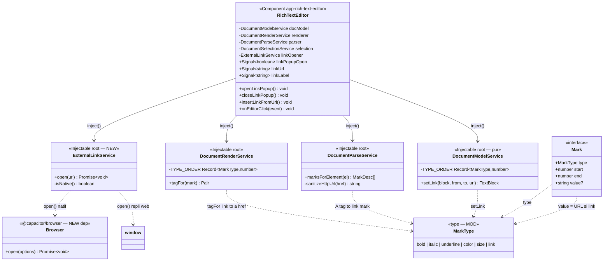

# Approche de développement — Insertion d'un lien dans une note

**Date :** 2026-09-18
**Statut :** brouillon — à valider
**SPEC de référence :** [`URL_LINK/FEATURE_INSERTION_LIEN.md`](URL_LINK/FEATURE_INSERTION_LIEN.md)
**Docs complétés :** [`DIAGRAMME_CLASSES_NOTES.md`](DIAGRAMME_CLASSES_NOTES.md) (§5–8, modèle document),
[`PLAN_MODELE_DOCUMENT_JSON.md`](PLAN_MODELE_DOCUMENT_JSON.md)

> **But de ce document :** décrire **comment** réaliser l'insertion de lien décrite par la SPEC,
> sans écrire ni test ni code final. Il précède [`plan_test`](skill/plan_test/SKILL.md).

---

## 0. Décisions de cadrage (validées le 2026-09-18)

Trois choix tranchés avant conception (ils modifient l'algorithme US5) :

1. **Le lien est une marque inline valuée**, `MarkType = 'link'`, l'URL portée par `Mark.value` —
   exactement comme `color`/`size`. **Pas** de nouveau type de bloc. (Confirme l'hypothèse SPEC.)
2. **Ouverture externe** : ajout de la dépendance **`@capacitor/browser`** (natif hors app sur
   mobile) avec **repli `window.open(url, '_blank')`** en contexte web (dev).
3. **Un tap sur un lien l'ouvre TOUJOURS**, que l'éditeur ait le focus ou non.
   → **Écart assumé avec US5** (qui excluait l'ouverture en édition). Conséquence sur US6 traitée
   au §5 (placement du curseur *dans* un lien préempté par l'ouverture ; la suppression reste
   possible depuis les bords / par sélection englobante).
4. **Sécurité** : seuls les schémas **`http` / `https`** sont acceptés — à l'**insertion**, au
   **parsing** (sanitation d'un collage) et à l'**ouverture**. `javascript:`, `data:`, etc. rejetés.

---

## 1. Diagramme de classes

> Périmètre restreint au **delta** de la fonctionnalité, calqué sur le §5 de
> `DIAGRAMME_CLASSES_NOTES.md`. Les membres **à créer / à modifier** sont marqués `» NEW`
> / `» MOD` dans leur classe ; le reste existe déjà. Légende sous le diagramme.



**Légende du delta**

| Élément | Statut | Rôle |
|---|---|---|
| `ExternalLinkService` | **NEW** | Ouvre une URL hors app (Capacitor Browser) ou en repli web. |
| `Browser` (`@capacitor/browser`) | **NEW dep** | Plugin natif d'ouverture externe. |
| `MarkType += 'link'` | **MOD** | Nouvelle marque inline valuée (URL). |
| `DocumentModelService.setLink` + `TYPE_ORDER` | **MOD** | Commande d'ajout du lien + ordre d'imbrication. |
| `DocumentRenderService.tagFor` + `TYPE_ORDER` | **MOD** | `link` → `<a href …>`. |
| `DocumentParseService.marksForElement` + `sanitizeHttpUrl` | **MOD** | `<a>` → marque `link` (sanitée). |
| `RichTextEditor` : signaux + méthodes popup / insertion / clic | **MOD** | Bouton, barre 2 champs, insertion, interception du tap. |

> Tout le reste (`DocumentSelectionService`, `NoteEditor`, `NotesService`, blocs, guards, cycle
> commit → render → setSelection) est **inchangé** : le lien réutilise l'algèbre d'intervalles
> existante (union/soustraction/normalisation), donc `deleteRange`, `splitBlock`, `mergeBlocks`,
> la persistance JSON et le round-trip `parse(render(m)) == m` fonctionnent **sans modification
> de logique** une fois `'link'` ajouté.

---

## 2. Vue d'ensemble — pourquoi l'existant fait 80 % du travail

La marque `link` est une **marque valuée**, jumelle de `color` (valeur = couleur) et `size`
(valeur = taille). Or l'algèbre d'intervalles (`document-model.ts`) est **générique sur
`(type, value)`** :

- `canonicalMarks` regroupe par clé `` `${type}:${value}` `` → deux liens d'URL différentes ne
  fusionnent jamais ; deux liens d'URL identique qui se touchent fusionnent (souhaitable).
- `deleteRange` / `intersectShift` / `cutMarks` rebasent et tronquent déjà toute marque → **US6
  (retrait par effacement) est gratuit** : effacer le texte d'un lien coupe la marque ; effacer
  tout le texte la supprime (marque nulle éliminée par `canonicalMarks`).
- `splitBlock` / `mergeBlocks` répartissent déjà les marques → un lien survit à Entrée/fusion.
- Persistance : `Mark` est déjà sérialisé tel quel dans `Note.blocks` (JSON) → **US4
  persistance gratuite**.

**Il reste donc à** : (A) déclarer le type, (B) le rendre/parser en `<a>`, (C) l'UI (bouton +
popup 2 champs), (D) l'insertion au curseur, (E) l'ouverture externe au tap.

---

## 3. Approche par lot

### Lot A — Modèle & algèbre pure  *(US3, US4, US6)*

**Fichiers :** `core/models/document.model.ts`, `core/services/document-model.ts`.

1. **Type** — `MarkType = … | 'link'`. Documenter `Mark.value` : pour `'link'`, valeur = URL
   `http(s)`. Aucun nouveau bloc, aucun guard à ajouter.
2. **Ordre d'imbrication `TYPE_ORDER`** — ajouter `link` dans **les deux copies** (model +
   render), **avec la même valeur**, sinon le rendu n'est plus déterministe.
   - Choix : **`link` = plus externe** (rang le plus bas) → HTML `<a><strong>…</strong></a>`,
     lecture naturelle. *(Choix libre : n'importe quel rang marche pour le round-trip tant que
     les deux tables concordent ; l'externe est juste le plus lisible.)*
3. **Commande `setLink(block, from, to, url)`** — miroir de `setColor` (délègue à la mécanique
   `setValueMark` : remplace tout `link` existant sur la plage puis pose le nouveau ; ré-appliquer
   la même URL sur une plage couverte la retire). Sert la **symétrie** et une éventuelle édition
   future ; pour ce lot, l'insertion (Lot D) sur du **texte neuf** pourrait aussi passer par
   `toggleMark(…, 'link', url)` (jamais actif sur du texte fraîchement inséré) — mais `setLink`
   est retenu pour l'homogénéité de l'API.

**Invariants conservés :** immutabilité (retourne de nouveaux objets), offsets UTF-16, marques
plates non imbriquées. **Cas limites :** URL vide → géré en amont (Lot D), pas au niveau modèle ;
plage collapsée → `editInline` renvoie le bloc normalisé inchangé (déjà le cas).

### Lot B — Rendu & parsing  *(US4 affichage, US2/US6 sécurité & round-trip)*

**Fichiers :** `core/services/document-render.ts`, `core/services/document-parse.ts`.

**Rendu (`tagFor`)** — nouveau cas `case 'link'` :
```
return [ `<a href="${escapeAttr(url)}" target="_blank" rel="noopener noreferrer">`, `</a>` ]
```
- `target/rel` assurent le repli web propre ; sur natif, le clic est intercepté (Lot E) avant que
  le `target` n'agisse.
- L'algorithme de « re-slicing » (`renderInline`) enrobe déjà chaque segment de ses marques
  actives dans l'ordre `TYPE_ORDER` → aucune autre modification.

**Parsing (`marksForElement`)** — nouveau cas balise `A` :
1. lire `href = el.getAttribute('href')` ;
2. `url = sanitizeHttpUrl(href)` — ne garde que `http:`/`https:` (via `new URL()` + test du
   protocole), sinon `''` ;
3. si `url` non vide → `[{ type:'link', value:url }]`, sinon `[]` (balise `<a>` **dégrafée**, le
   texte est conservé sans marque).
- `appendInline` traite déjà `<a>` comme un élément inline générique (il descend dans les enfants
  et pose la marque à la **fermeture** sur `[start, end)`) → il suffit que `marksForElement`
  reconnaisse `A`.

**Cas limites / sécurité :** `<a>` sans `href`, `href="javascript:…"`, `href` relatif non
résolu → marque **droppée**, texte gardé (sanitation d'un collage, US2). **Round-trip :**
`render` écrit `href="https://…"`, `parse` relit via `getAttribute` (décodé) → `sanitizeHttpUrl`
renormalise → intervalle identique ⇒ `parse(render(m)) == m` préservé. À **couvrir par un test de
round-trip** dédié (spec `plan_test`).

### Lot C — Barre d'outils & barre d'insertion  *(US1, US2)*

**Fichiers :** `rich-text-editor.html`, `rich-text-editor.ts` (signaux/handlers UI), `.css`.

> **Principe (demande utilisateur 2026-09-18) : rester au plus près de la barre vidéo.** La barre
> lien est un **3ᵉ bloc `@if` copié sur `@if (videoPopupOpen())`** — **aucun composant popup,
> aucun service de popup, aucune abstraction paramétrée**. On ajoute juste **un `input` de plus**
> (le libellé) et on renomme classes/handlers. On réutilise les classes existantes `media-popup`
> / `popup-row` / `btn-close-popup`, donc **le CSS s'applique quasi tel quel** (au plus un
> ajustement pour aligner deux champs sur la ligne).

1. **Bouton** `btn-link` (🔗) dans le `toolbar-group` des médias, à côté de `btn-image`/`btn-video`,
   sur le **modèle exact de `btn-video`** (`title`/`aria-label` « Insérer un lien »,
   `(mousedown)="$event.preventDefault()"`, `(click)="openLinkPopup()"`).
2. **Signaux** (jumeaux de `videoUrl`) : `linkPopupOpen = signal(false)`, `linkUrl = signal('')`,
   `linkLabel = signal('')`.
3. **Barre d'insertion** — copie de la barre vidéo avec **un champ de plus** :
   ```html
   @if (linkPopupOpen()) {
     <div class="media-popup link-popup" role="dialog" aria-label="Insérer un lien">
       <div class="popup-row">
         <input
           type="text"
           class="link-url-input"
           placeholder="Lien (https://…)"
           [value]="linkUrl()"
           (input)="linkUrl.set($any($event.target).value)"
         />
         <input
           type="text"
           class="link-label-input"
           placeholder="Texte à afficher"
           [value]="linkLabel()"
           (input)="linkLabel.set($any($event.target).value)"
         />
         <button type="button" class="btn-link-insert" (click)="insertLinkFromUrl()">
           Insérer le lien
         </button>
       </div>
       <button
         type="button"
         class="btn-close-popup"
         (click)="closeLinkPopup()"
         aria-label="Fermer"
       >
         ✕
       </button>
     </div>
   }
   ```
4. **`openLinkPopup()` / `closeLinkPopup()`** — jumeaux de `openVideoPopup`/`closeVideoPopup`
   (US1 : la croix ferme sans rien insérer, les deux champs sont réinitialisés) :
   ```ts
   openLinkPopup(): void { this.linkPopupOpen.set(true); }
   closeLinkPopup(): void {
     this.linkPopupOpen.set(false);
     this.linkUrl.set('');
     this.linkLabel.set('');
   }
   ```

### Lot D — Insertion du lien au curseur  *(US3, US2)*

**Fichier :** `rich-text-editor.ts` — méthode `insertLinkFromUrl()`.

**Même forme que `insertVideoFromUrl` :** `trim` → **no-op si vide** → insertion → `closeLinkPopup()`.
La **seule** différence irréductible : un lien est **du texte inline** (pas un bloc), donc au lieu
d'appeler `insertBlock`, la méthode réutilise le **pipeline pur déjà en place** dans l'éditeur
(`docModel.insertText` + `docModel.setLink` + `commit`), exactement comme le font déjà `applyMark`
/ `applyColor`. **Aucun service ni abstraction nouvelle** côté insertion.

**Entrées :** `linkUrl()`, `linkLabel()`, la sélection courante. **Sortie :** nouveau `DocModel`
commité + popup fermée.

```
insertLinkFromUrl():
  url = sanitizeHttpUrl(trim(linkUrl()))          // '' si vide ou schéma refusé
  if url == '' : return                           // no-op (US2 : URL vide / invalide)
  label = trim(linkLabel())
  if label == '' : label = url                    // repli libellé = URL (US2)

  range = selectedRange(editor)                   // {blockId, from, to} single-block ou null
  if range != null and model[blockId] est TextBlock :
      block   = model[idx]
      base    = (from == to) ? block : docModel.deleteRange(block, from, to)   // remplace la sélection
      withTxt = docModel.insertText(base, from, label)                         // insère le libellé
      linked  = docModel.setLink(withTxt, from, from + label.length, url)      // pose la marque
      newModel = model avec [idx] ← linked
      end = from + label.length
      commit(newModel, { blockId, from: end, to: end })                        // curseur APRÈS le lien
  else :
      // Pas de curseur dans un bloc texte (bloc média sélectionné, doc vide…) :
      // cohérent avec les médias → nouveau bloc texte inséré à insertionIndex.
      idx = insertionIndex(editor, model)
      newBlock = normalize({ id: uuid(), kind:'text', text: label,
                             marks:[{ type:'link', start:0, end:label.length, value:url }] })
      newModel = splice(model, idx, newBlock)
      commit(newModel, { blockId: newBlock.id, from: label.length, to: label.length })

  closeLinkPopup()                                // ferme + réinitialise (US3)
```

**Points clés :**
- Le libellé est du **texte neuf** → `insertText` décale correctement les marques voisines ; la
  marque `link` posée sur `[from, from+len)` ne chevauche aucun lien existant.
- **Curseur après le lien** (US3 : « la frappe se poursuit hors du lien ») → `commit` restaure une
  sélection collapsée à `end`. Comme `end` est la borne **exclue** de la marque, la frappe
  suivante n'hérite pas du lien (les marques sont `[start, end)`).
- **Cas limites :** sélection multi-blocs → `selectedRange` renvoie `null` → branche « nouveau
  bloc » (comportement cohérent médias) ; libellé contenant des espaces → `trim` (US2) ;
  caractères spéciaux dans le libellé → échappés au rendu (`escapeText`).

### Lot E — Ouverture externe au tap  *(US5)*

**Fichiers :** nouveau `core/services/external-link.ts`, `rich-text-editor.html/.ts`,
`package.json` (dépendance).

1. **Dépendance** — ajouter `@capacitor/browser` (**version alignée sur `@capacitor/core` v8**),
   puis `npx cap sync`. ⚠️ Voir §4 : incohérence pré-existante `@capacitor/cli ^7` vs `core ^8`.
2. **`ExternalLinkService.open(url)`** :
   ```
   open(url):
     url = sanitizeHttpUrl(url); if url == '' : return        // défense en profondeur
     if Capacitor.isNativePlatform() : await Browser.open({ url })   // hors app (mobile)
     else : window.open(url, '_blank', 'noopener')                  // repli web (dev)
   ```
3. **Interception du tap** — `RichTextEditor.onEditorClick(event)`, câblé via `(click)` sur la
   zone `.editor-content` :
   ```
   onEditorClick(event):
     a = (event.target as HTMLElement).closest('a')
     if a and a.href :
        event.preventDefault()                 // empêche le comportement natif du <a>
        linkOpener.open(a.getAttribute('href'))
   ```
   → **ouvre toujours**, focus ou non (décision §0.3).

**Cas limites :** clic hors d'un `<a>` → rien (édition normale) ; `href` invalide (ne devrait pas
exister après sanitation à l'insertion/au parse) → `open` no-op.

---

## 4. Impacts & points d'attention

- **Écart US5 assumé** : l'ouverture au tap étant **inconditionnelle**, **placer le curseur
  *dans* un lien par un simple tap devient impossible** (le tap ouvre le navigateur). Impact sur
  **US6** : la suppression d'un lien reste possible en (a) plaçant le curseur **juste après/avant**
  puis Retour arrière/Suppr caractère par caractère, ou (b) sélectionnant une plage **englobant**
  le lien puis en effaçant. À **valider en test manuel** (mobile) et à documenter pour
  l'utilisateur. *(Alternative si gênant : n'ouvrir que hors focus — non retenu.)*
- **Deux copies de `TYPE_ORDER`** (model + render) : risque de désynchronisation → les faire
  évoluer ensemble ; un test de round-trip avec `link` + autres marques cumulées le verrouille.
- **Incohérence Capacitor pré-existante** : `@capacitor/cli ^7.6.9` vs `@capacitor/core ^8.5.1`.
  Prendre `@capacitor/browser` en **v8** (aligné sur `core`) ; signaler/planifier la mise à niveau
  du CLII séparément (hors périmètre).
- **Migration de données** : **aucune**. Les notes existantes sans lien restent valides ; le champ
  `Mark.value` existe déjà.
- **Highlight de la barre d'outils** : pas d'état « lien actif » dans `ActiveState` pour ce lot
  (insertion seule, pas de bascule depuis une sélection) — **différé**.
- **Sécurité** : `sanitizeHttpUrl` est le **point unique** de filtrage, appelé à l'insertion, au
  parse et à l'ouverture (défense en profondeur). Refuser `javascript:`/`data:` y est central.

---

## 5. Découpage suggéré (ordre de réalisation)

1. **Lot A** (modèle + `setLink` + `TYPE_ORDER`) — socle, testable en isolation (pur).
2. **Lot B** (render `<a>` + parse `A` + `sanitizeHttpUrl` + **round-trip**) — dépend de A.
3. **Lot D** (insertion `insertLinkFromUrl`) — dépend de A ; testable avant l'UI via appels directs.
4. **Lot C** (bouton + barre 2 champs) — UI, câble D.
5. **Lot E** (`ExternalLinkService` + `onEditorClick` + dépendance) — indépendant de C/D, à faire
   en dernier (touche le natif / `cap sync`).

Chaque lot enchaînera **`plan_test` → `ecrire_tests` → implémentation** (skills du dépôt).

**Hors périmètre de ce lot** (rappel SPEC) : édition d'un lien posé (UI dédiée), bouton « retirer
le lien », auto-linkification, prévisualisation enrichie, liens internes (note/date), validation
métier de l'URL distante.

---

## 6. Rattachement aux User Stories

| US | Couverte par |
|---|---|
| US1 — ouvrir la fenêtre | Lot C (bouton + popup + croix qui réinitialise) |
| US2 — saisir URL + libellé | Lot C (2 champs) + Lot D (trim, repli libellé=URL, no-op URL vide) + Lot B (sanitation) |
| US3 — insérer au curseur | Lot D (`insertLinkFromUrl`, curseur après le lien) |
| US4 — voir/reconnaître + persistance | Lot B (`<a>`) + Lot A (marque sérialisée en JSON) |
| US5 — ouvrir en externe | Lot E (`ExternalLinkService` + tap) — *nuance « édition » levée, cf. §0.3/§4* |
| US6 — retirer en effaçant | Lot A (algèbre `deleteRange`/`canonicalMarks`, gratuit) — *cf. point d'attention §4* |
